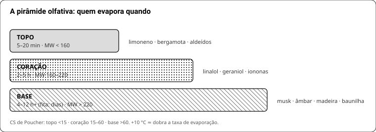
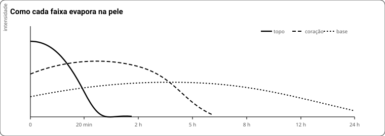

# LIVRO 1 — O cheiro e a matéria-prima

Catálogo dos 587 materiais: [01b](01b-catalogo-por-familia.md).

---

## 1. Como o olfato funciona

- ~400 tipos de receptor. Cada molécula ativa um **padrão** de receptores, não um receptor. Por isso não existe escala objetiva de cheiro e por isso duas moléculas quimicamente distantes podem cheirar igual.
- **Adaptação**: o receptor satura em **15–30 s** de estímulo contínuo. Você para de sentir o que está no seu próprio pulso em minutos — e é por isso que **você é a pior pessoa para julgar o próprio perfume**.
- **Anosmia específica**: 30–50% das pessoas não sentem certos almíscares macrocíclicos; para Iso E Super a taxa também é alta. Se um material "não cheira nada" para você, pode ser anosmia sua, não material fraco. Teste: peça a outra pessoa.
- Não existe reset. Cheirar café ou o próprio braço é folclore — o que resolve é **ar limpo e tempo**.

**Treinar o nariz, protocolo de 8 semanas:**

| Semana | Exercício |
|---|---|
| 1–2 | 5 materiais, um por dia, a 10% na fita. Escrever 3 descritores antes de olhar o rótulo |
| 3–4 | Os mesmos 5 em pares (cap. 16). Identificar qual domina |
| 5–6 | Teste cego: outra pessoa numera as fitas, você identifica |
| 7–8 | Reconhecer os mesmos materiais **dentro** de perfumes comerciais |

Errar cego é normal no começo. Quem não faz cego aprende a reconhecer o rótulo, não o cheiro.

**Quando não avaliar:** com fome, gripado, depois de fumar, com perfume no corpo, depois de 10 fitas.

## 2. Famílias e vocabulário

Dois sistemas. Edwards para conversar, SFP para classificar.

| Edwards (roda, 1992/2021) | SFP clássico (1984) |
|---|---|
| Amber | Oriental |
| Soft Floral | Floral Aldeídico |
| Mossy Woods | **Chypre** |
| Aromatic (Fresh) | **Fougère** |
| Dry Woods | Leather |

SFP: 7 famílias, 47 subfamílias — Citrus (A), Floral (B), Fougère (C), Chypré (D), Woody (E), Amber (F), Leather (G).
**"Gourmand" e "musk" não são famílias** — são acentos que atravessam todas.

**Vocabulário mínimo** (use estes, não "cheiroso"):

| Eixo | Descritores |
|---|---|
| Temperatura | frio, fresco, morno, quente, escaldante |
| Textura | seco, cremoso, ceroso, oleoso, pulverulento/empoado, metálico, aveludado |
| Peso | transparente, leve, denso, pesado, sufocante |
| Doçura | seco, adocicado, doce, açucarado, enjoativo |
| Brilho | opaco, fosco, brilhante, radiante, ofuscante |
| Caráter | verde, terroso, animal, mineral, resinoso, fenólico, lactônico, aldeídico |

Descrição útil = **família + 2 facetas + 1 defeito**. Ex.: "amadeirado, seco e empoado, com uma ponta de serragem".

## 3. Volatilidade: topo, coração, base

A fronteira é difusa **de propósito** — o mesmo linalol é topo numa fonte e coração em outra.

| Critério | Topo | Coração | Base | Confiabilidade |
|---|---|---|---|---|
| **CS de Poucher (1–100)** | <15 | 15–60 | >60 | peer-reviewed, é a âncora |
| Substantividade em fita (h) | baixa | média | até ≥400 h | idem |
| Pressão de vapor 25 °C (Torr) | >0,1 | 0,001–0,1 | <0,001 | heurística |
| Massa molar | <160 | 160–220 | >220 | heurística fraca |



**Duração na pele:** topo 5–20 min · coração 2–5 h · base 4–12 h+ (em fita, dias).
**+10 °C ≈ dobra a taxa de evaporação.** Pele quente e verão: mais projeção, menos duração.

| Material | MW | Nota | Na pele | Observação |
|---|---|---|---|---|
| Etil butirato | — (PE 121 °C) | T | minutos | frutado que some |
| Limoneno / mirceno | 136 | T | 30–60 min | oxida |
| Linalol | 154 | T/C | 2–4 h | fronteira clássica |
| Geraniol | 154 | C | 3–5 h | |
| Eugenol | 164 | C | 4–6 h | |
| Linalil acetato | 196 | C | 4–6 h | |
| α-santalol | 220 | B | 12–24 h | sândalo natural |
| Cedrol | 222 | B | 12–24 h | |
| Patchoulol | 222 | B | 24 h+ | |
| Iso E Super | 234 | B | 15 h+ | difunde apesar de ser base |
| Ambroxan | 236 | B | 20 h+ | fita >400 h |
| Galaxolide | 258 | B | 24 h+ | |
| Hexil cinamaldeído | — (PE 308 °C) | B | dias em fita | |



**Como descobrir sozinho:** fita com 1 gota a 10%, avaliada em 15 min, 1 h, 4 h, 24 h e 72 h. O tempo até "não sinto mais nada" **é** a classificação.

## 3b. Quanto tempo cada óleo essencial dura

A pergunta certa não é "quantas horas dura o óleo" — é **qual molécula dele sobra**. Um óleo essencial é
uma mistura: o limão é ~65% limoneno (MW 136, some em 30 min) e ~2% citral (MW 152, aguenta 2–3 h). O que
você sente no fim é a fração tenaz, não o óleo.

Os números abaixo são **ordem de grandeza, na pele, em dose de uso dentro de uma fórmula**. Em fita
olfativa tudo dura de 3 a 10× mais. Calor, pele oleosa e dose mudam o resultado.

### Cítricos — os que somem

| Óleo | Dominante | Na pele | Observação |
|---|---|---|---|
| Laranja doce | limoneno ~95% | **15–40 min** | o mais volátil de todos |
| **Limão siciliano** | limoneno ~65%, γ-terpineno, citral 2–3% | **15–45 min** | o citral é o que sobra no fim |
| **Lima Taiti (prensada)** | limoneno ~50%, terpinenos | **20–50 min** | mais verde e amarga que o limão |
| Lima Taiti (destilada) | terpenos leves | **30–60 min** | menos fiel à fruta, mais estável e **sem fototoxicidade** |
| Toranja / grapefruit | limoneno + nootkatona traço | **20–45 min** | a nootkatona segura uma ponta amarga |
| Mandarina verde | limoneno + metil antranilato | **30–60 min** | o antranilato é tenaz: dura mais que os irmãos |
| **Bergamota** | linalil acetato ~30% + linalol | **1–2 h** | por isso é a base de toda colônia |
| Petitgrain | linalil acetato + linalol | **2–4 h** | o "cítrico que fica" |

**A resposta direta:** limão siciliano e lima taiti duram **menos de uma hora** na pele. Não existe
truque que faça o limoneno durar — ele evapora porque é leve, e ponto.

### Herbais e florais

| Óleo | Na pele | Observação |
|---|---|---|
| Citronela | 1–3 h | citronelal; repelente, satura rápido |
| Manjericão · tomilho · manjerona · alecrim | 1–3 h | fenólicos e terpenos leves |
| Lavanda · lavandim | 2–4 h | linalol + linalil acetato |
| Gengibre · pimenta preta · pimenta rosa · cardamomo | 2–4 h | especiarias frescas somem mais rápido do que se imagina |
| Palmarosa | 3–5 h | geraniol quase puro — rosa barata e útil |
| Sálvia esclareia | 4–6 h | esclareol, ponte para o âmbar |
| Lavandin absoluto | 4–8 h | o absoluto dura o dobro do destilado (2–4 h) |
| Davana | 6–10 h | frutado-denso, tenacíssimo para um "floral" |

### Madeiras, resinas e raízes — os que ficam

| Óleo | Na pele | Em fita |
|---|---|---|
| Cipreste · elemi | 3–6 h | 1–2 dias |
| Olíbano | 6–12 h | dias |
| Cedro Texas · cedro do Atlas | 8–16 h | dias |
| Guaiacwood · amyris | 12–24 h | dias |
| Mirra | 12–24 h | dias |
| **Vetiver · patchouli · cypriol** | **24 h+** | **semanas** |
| Musgo de carvalho | 24 h+ | semanas (IFRA 0,10%) |

### O que fazer com isso

1. **Não tente esticar o cítrico.** Dobrar a dose rende pouco (lei de Stevens: 10× a dose ≈ 3–4× a
   percepção) e esbarra na IFRA — limão ~2%, bergamota prensada **0,40%**.
2. **Ancore.** Com musk e âmbar embaixo, a impressão de "fresco" persiste depois que o limoneno já foi.
   Não é o limão durando: é a fórmula inteira segurando a leitura.
3. **Troque por análogo tenaz** quando o produto exigir: **dihidromircenol** (lima-colônia, 1–40%),
   **Lemonile** (nitrilo de limão), **citral** em dose controlada, **tetrahidro linalol**.
4. **Use a versão destilada ou FCF** em leave-on: menos fototoxicidade e menos oxidação.
5. **Em sabonete, o cítrico natural praticamente não chega ao fim do banho.** Ali o sintético estável não
   é preferência, é a única coisa que funciona.
6. **Compre pouco e fresco.** Cítrico oxidado não só perde o cheiro: vira sensibilizante.

## 4. Tipos de matéria-prima

| Tipo | O que é | Prós | Contras |
|---|---|---|---|
| **Óleo essencial** | destilado da planta | complexidade natural | varia por safra, oxida, adulteração comum, IFRA por componente |
| **Absoluto** | extraído por solvente | fiel à flor | caro, escuro, mancha |
| **Isolado / químico aromático** | molécula única | **reprodutível, barato, previsível, rastreável** | precisa saber combinar |
| **Base / especialidade** | acorde pronto vendido como ingrediente | atalho enorme | você não sabe o que tem dentro nem o IFRA real |
| **Resinoide / CO₂** | extração por pressão/solvente | fixação, profundidade | viscoso, difícil de pesar |

**Para quem quer reprodutibilidade, isolado é a base do trabalho.** Óleo essencial entra como "tempero" quando a complexidade compensa a variação.

## 5. Famílias químicas — o que esperar

| Classe | Exemplos | Caráter | Comportamento e cuidado |
|---|---|---|---|
| **Terpenos** | limoneno, mirceno, pineno | cítrico, resinoso | voláteis; **oxidam e viram sensibilizantes** → IFRA por valor de peróxido |
| **Álcoois terpênicos** | linalol, geraniol, citronelol | floral macio | meio-termo de volatilidade; oxidam menos que os terpenos |
| **Ésteres / acetatos** | linalil acetato, benzil acetato | frutado, doce, "fresco-floral" | fáceis, dóceis, baratos; podem hidrolisar em meio alcalino (sabão) |
| **Aldeídos alifáticos** | C-10, C-11, C-12 | ceroso, sabão, "gritante" puro | só funcionam diluídos (1–10%); IFRA aperta em 1–2% |
| **Aldeídos aromáticos** | cinamaldeído, heliotropina | especiado, amêndoa, baunilha | cinamaldeído é muito sensibilizante (0,05–0,25%) |
| **Cetonas / iononas** | α/β-ionona, metil ionona, Cashmeran | violeta, íris, empoado | tenazes, bem toleradas |
| **Lactonas** | γ-undecalactona, γ-nonalactona | pêssego, coco, cremoso | 0,05–0,5%; >0,2% fica oleoso/pesado |
| **Fenóis** | eugenol, isoeugenol, guaiacol | cravo, fumaça, medicinal | potentes e limitados por IFRA |
| **Almíscares macrocíclicos** | Exaltolide, Habanolide, ambrettolide | limpo, pele, sabão | caros, elegantes, alta substantividade |
| **Almíscares policíclicos** | Galaxolide, Tonalide | roupa lavada | baratos, potentes; Galaxolide limitado a 1,5% leave-on (ambiental) |
| **Âmbares** | Ambroxan, Ambrox DL, Cetalox | mineral, seco, "pele" | base **que difunde** — ponte topo↔base |
| **Sândalos sintéticos** | Javanol, Ebanol, Sandalore | cremoso, leitoso | Javanol é extremo: traço a 2% |

## 6. Ler uma ficha — exemplo real

Iso E Super, do banco do app:

```
CAS —          |  MW 234,38  |  PE 339,62 °C  |  logP 3,6  |  C16H26O
nota: base     |  força: baixa
dose: 5 – 14 – 40 %   (baixa – típica – alta)
IFRA: sem limite no banco (o padrão se aplica ao OTNE; historicamente Cat 4 ~20%)
percepção:  5% quase inaudível, só arredonda
           14% cedro nítido com âmbar atrás, constrói o rastro
           40% seca demais, vira serragem e engessa
```

Como ler:
- **MW 234 + PE 340 °C** → base, evaporação lenta. Confere com a classificação.
- **logP 3,6** → afinidade por gordura média-alta: fica na pele, sai pouco com a água.
- **"força baixa" com dose de 5–40%** → não é fraco, é **transparente**: entra em dose alta como volumizador, não como nota.
- **Percepção por faixa** é mais útil que a dose única: diz o que acontece quando você erra para cima.

> **Dose do catálogo ≠ limite físico.** É recomendação conservadora do fornecedor. Fórmula publicada por perfumista que formulou de verdade manda mais — no Imagination o Ambrox entra a 21,7% do concentrado.

## 7. Oxidação, degradação e armazenamento

**O que estraga, em ordem de importância: oxigênio > luz > calor > tempo.**

| Material | Validade prática | Sinal de estrago |
|---|---|---|
| Cítricos prensados | 1–2 anos | cheiro de verniz/terebintina, cor escura |
| Óleos essenciais em geral | 2–3 anos | idem, mais fraco |
| Álcoois e ésteres terpênicos | 3–5 anos | nota "papelão" |
| Aldeídos | 2–3 anos | nota rançosa |
| Almíscares, âmbares, cetonas | ~indefinido | praticamente não degradam |
| Absolutos e resinoides | longa | cristalizam (não é defeito) |
| Diluições em álcool | 1–2 anos com BHT | turvação, nota ácida |

**Prática:** frasco **cheio até quase a borda** (menos ar), âmbar ou armário fechado, tampa de rosca, temperatura estável. **BHT 0,1%** (1 mg/g) em toda diluição. Não guardar em conta-gotas de borracha — o elastômero é atacado e contamina.

**Terpeno oxidado é sensibilizante.** É por isso que a IFRA regula limoneno e linalol por **valor de peróxido**, e não por concentração: o problema não é a molécula, é a molécula velha.

## 8. Fornecedores e adulteração

**Fornecedor confiável informa:** nome INCI, **CAS**, lote, origem, ficha técnica e, quando aplicável, certificado IFRA. Se não informa, você não sabe o que comprou — e não pode declarar no rótulo depois.

**Sinais de óleo essencial adulterado:**
1. Preço muito abaixo do mercado (rosa, sândalo, melissa, camomila azul, néroli são caros — não existe barato).
2. **"Óleo essencial" de fruta que não produz óleo**: morango, pêssego, melão, maçã, coco, baunilha (baunilha é extrato/absoluto, não OE). Se está escrito "óleo essencial", é fragrância sintética rotulada errado.
3. Cheiro linear demais e sem evolução na fita em 4 h.
4. Mancha oleosa permanente em papel (OE puro evapora quase sem resíduo; carreador barato não).
5. Densidade e índice de refração fora da faixa da ficha (se o fornecedor não tem a ficha, ponto 1).

**Isolado é mais difícil de adulterar que óleo essencial** — mais uma razão para preferir.

## 9. Segurança do próprio perfumista

| Risco | O que é | Prática |
|---|---|---|
| **Sensibilização cumulativa** | você não nasce alérgico, fica — e é **irreversível** | nunca manusear neat o que dá para manusear diluído; luva nitrílica; ventilação |
| **Fototoxicidade** | bergapteno de cítrico prensado + sol = queimadura | **FCF / livre de bergapteno** em qualquer leave-on |
| **Inalação** | vapor de solvente, pó de tensoativo | ambiente arejado; **PFF2** para pó |
| **Contato com álcali/ácido** | soda, ácido cítrico concentrado | óculos e luva |
| **Ingestão acidental** | frasco sem rótulo | rotular **antes** de encher, sempre |

**Patch test, protocolo:**
1. Material a **5–10% em jojoba ou DPG** (não neat).
2. 1 gota na face interna do antebraço, área de ~1 cm².
3. Cobrir com curativo, **48 h** sem molhar.
4. Ler em 48 h e de novo em **96 h** (reação tardia é a regra em sensibilização).
5. Qualquer vermelhidão, coceira ou pápula = não use naquele material, nem em dose menor.

Faça antes de incluir material novo em qualquer coisa que vá no corpo — e refaça quando **você** mudar (sensibilização é adquirida).

## 10. IFRA na prática

Três coisas que quase todo iniciante erra:

1. **O limite é do produto acabado**, não do concentrado. Perfume a 20% com Cat 4 de 1% → o material pode ir até **5% do concentrado**.
2. **Conta o total**, venha o material puro ou **dentro de um óleo essencial**. Se você usa geraniol puro e ainda 10% de gerânio (que tem geraniol), soma os dois.
3. **Categoria é por produto**: 4 perfume · 5A loção corporal · 5B creme facial · 9 rinse-off.

**Cálculo, exemplo real.** Perfume EDP a 20%, com **cumarina** (Cat 4 = 1,5%):
- limite no produto = 1,5% → em 30 ml (~28,5 g) = 0,4275 g de cumarina
- concentrado = 30 × 0,20 × 0,95 = **5,7 g**
- teto no concentrado = 0,4275 ÷ 5,7 = **7,5%** do concentrado
- ou seja: até 7,5% de cumarina na fórmula, porque ela será diluída 5×.

Limites Cat 4 (51ª emenda) dos que mais aparecem:

| Material | Cat 4 | Observação |
|---|---|---|
| Rose ketones (damascone/damascenona) | **0,043%** | orçamento **compartilhado** entre todas |
| Oakmoss / tree moss | 0,10% | cumulativo entre os dois |
| Isoeugenol | 0,11% | |
| Cinamaldeído | 0,25% (conflito: 0,05%) | conferir emenda vigente |
| Bergamota expressa | 0,40% | FCF ~livre |
| Citral | 0,60% | |
| Jasmim absoluto | 0,60% | |
| Cumarina | 1,50% (pode ter caído p/ 1,0%) | |
| **Galaxolide** | **1,5% leave-on** | motivo **ambiental** (PBT), não alergia |
| Limão prensado | ~2,0% | |
| Aldeído C-12 | 2,0% | |
| Hidroxicitronelal | 2,10% | |
| Eugenol | 2,50% | |
| Cashmeran | 3,8% | |
| Geraniol | 4,70% | |
| Citronelol | 12% | |
| Iso E Super | ~20% | |
| Metil ionona | 30% | |
| **Linalol, limoneno** | sem teto | limite de **peróxido** |

**Proibidos:** **Lilial** (banido na UE desde 01/03/2022, toxicidade reprodutiva) e **HICC/Lyral** (Anexo II, sensibilizante). Tabela antiga com 0,20%/1,40% para eles está morta.

## 11. Alérgenos declaráveis — Brasil

**RDC 530/2021: 26 substâncias** de declaração obrigatória no rótulo, acima de:
- **0,001%** em leave-on (creme, loção, perfume)
- **0,01%** em rinse-off (sabonete, shampoo)

Os que provavelmente estão na sua fórmula: **limoneno, linalol, citronelol, geraniol, cumarina, citral, eugenol, isoeugenol, benzil acetato, benzil salicilato, benzil álcool, farnesol, hidroxicitronelal, α-isometil ionona, cinamaldeído, álcool cinâmico, amil e hexil cinamal**.

**Exemplo, seu sabonete com 3% do acorde Imagination adaptado:**

| Material | % do acorde | % na barra | Gatilho rinse-off 0,01% | Vai no rótulo? |
|---|---|---|---|---|
| Linalol | 1,78% | 0,053% | sim | **sim** |
| Citronelol | 0,96% | 0,029% | sim | **sim** |
| Cumarina | 0,69% | 0,021% | sim | **sim** |
| Geraniol | 0,35% | 0,011% | sim | **sim** |
| Citral | 0,17% | 0,005% | não | não |
| Limoneno (dos cítricos) | ~1,5%+ | ~0,05% | sim | **sim** |

O mesmo produto como **creme a 0,3%** cruzaria o gatilho de 0,001% em praticamente todos.

A UE já exige **81** substâncias (Reg. 2023/1545, transição até 31/07/2026). Se cogita exportar, formule pela lista europeia desde já — refazer rótulo depois custa mais.
