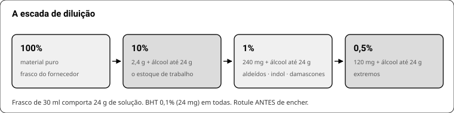
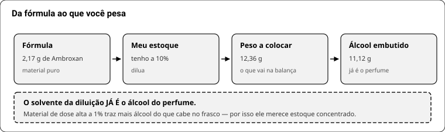
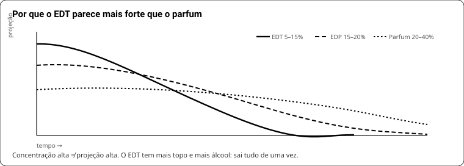

# LIVRO 2 — A bancada e a criação

## 12. Equipamento

| Item | Especificação | Por quê | Custo |
|---|---|---|---|
| **Balança 0,001 g** | com anteparo contra vento | material potente entra em miligrama | R$ 150–300 |
| Balança 0,01 g até 500 g | — | álcool e lotes | R$ 60–120 |
| Pipetas Pasteur | 3 ml, descartáveis | **uma por material**, sem exceção | R$ 0,20 cada |
| Frascos âmbar 30 ml | tampa de rosca, sem conta-gotas de borracha | estoque de diluição | R$ 3–5 |
| Béquer 50 e 100 ml | vidro | pesagem | R$ 15 |
| Fitas olfativas | papel absorvente sem cheiro | **nunca sulfite** | R$ 30/100 |
| Álcool de cereais 96° | de perfumaria | o de farmácia tem desnaturante que cheira | R$ 40/L |
| BHT | antioxidante | 0,1% em toda diluição | R$ 20/100 g |
| Etiquetas + caneta permanente | — | rotular **antes** de encher | — |

**Desperdício no início:** kit de 100 óleos essenciais, homogeneizador, banho ultrassônico, frasco bonito, agitador magnético.
**A balança de 0,001 g é o único item em que não se economiza** — sem ela não há reprodutibilidade, e sem reprodutibilidade não há aprendizado.

## 13. Diluições de trabalho

**O número que rege tudo: frasco de 30 ml comporta 24 g de solução final.** Álcool é mais leve que água e o frasco precisa de ar.

| Diluição | Matéria-prima | Álcool | BHT |
|---|---|---|---|
| **10%** (padrão) | 2,4 g | completar até 24 g | 24 mg |
| 1% | 240 mg | até 24 g | 24 mg |
| 0,5% | 120 mg | até 24 g | 24 mg |

**Ordem:** rotular (nome + % + data) → tarar o frasco → BHT → matéria-prima → álcool até o peso total.

**Quem exige diluição pesada:** aldeídos (avaliar a 1%) · indol (1%; uso final 0,1–0,5%) · rose oxide, damascones, Ambroxan (avaliar a ≤1%) · geosmina (0,001%).

**Regra de estoque, e o motivo está no cap. 19:**

| Tipo de material | Diluição de estoque |
|---|---|
| Dose alta (Hedione, Iso E Super, Ambroxan, dihidromircenol) | **100% ou 10%** |
| Dose média (iononas, cumarina, geraniol) | 10% |
| Traço (damascones, rose oxide, indol, aldeídos) | 1% |
| Extremos (geosmina, mercaptanas) | 0,1% ou menos |

## 14. Fita olfativa

1. Mergulhar **5 mm**, escrever o nome **antes** de cheirar.
2. Rajadas de 2–3 s, com pausa. Não inspirar fundo.
3. Reavaliar **a mesma fita** em 15 min, 1 h, 4 h, 24 h, 72 h — é aí que a volatilidade aparece.
4. Máximo ~10 materiais por sessão.
5. Comparação sempre **A/B na mesma mão**, nunca de memória.
6. Registre em ficha: nome, diluição, data, e uma linha por tempo de leitura.

**Fita ≠ pele.** A pele tem gordura, calor e pH próprio: materiais lipofílicos (logP alto) duram mais nela; voláteis duram menos. Avaliação final é sempre **na pele**, em pelo menos duas pessoas.

## 15. Caderno de bancada

Por lote: **número · data · fórmula em partes · diluição de cada estoque · peso real pesado de cada material · rendimento · o que mudou em relação ao lote anterior · avaliação em 3 tempos.**
Sem isso você não repete o acerto. Para vender, é obrigação legal (rastreabilidade — Livro 9).

## 16. Método Jean Carles

Aprender material, não decorar fórmula.

**Etapa 1 — individual.** Cada material sozinho, a 10%, na fita, relido em 24 h.

**Etapa 2 — dois a dois**, em escada fixa. Exemplo real, lavanda × cumarina:

| Fita | Lavanda | Cumarina | O que se aprende |
|---|---|---|---|
| A | 9 | 1 | lavanda com um fundo de feno |
| B | 8 | 2 | começa a virar fougère |
| C | 7 | 3 | **o ponto em que o acorde "vira"** |
| D | 6 | 4 | cumarina começa a dominar |
| E | 5 | 5 | doce demais, lavanda sumiu |

Escolhe-se a melhor e ela vira "o par". **O aprendizado está em achar o ponto de virada**, não em achar a melhor fita.

**Etapa 3 — três a três.** Pegar o par vencedor (digamos 7:3) e introduzir o terceiro na mesma escada: 9:1, 8:2, 7:3 de (par):(novo).

**Etapa 4 — bases (coeurs).** Acordes que funcionaram viram bloco guardado e rotulado. É assim que se compõe rápido depois — você para de montar do zero.

**Estrutura clássica de composição:** base ~55% + coração/modificadores ~20% + topo ~25%.

## 17. Acordes de referência (em partes)

| Acorde | Fórmula |
|---|---|
| **Fougère iniciante** | Bergamota 45 · Lavanda 25 · Cumarina 9 · Gerânio 7 · Patchouli 4 · Tonalide 4 · Amil salicilato 3 · Oakmoss 3 |
| **Fougère comercial** | Lavanda 115 · Bergamota FCF 105 · Cumarina 105 · Linalil acetato 70 · Metil ionona 42 · Vetiver 40 · Anisil acetato 35 · Isobutil salicilato 35 · Oakmoss 35 |
| **Chypre (Jean Carles, 55/20/25)** | Base 55%: oakmoss 6, cumarina 4, musk cetona 1 · Coração 20%: jasmim abs 3, civet 10% 1 · Topo 25%: laranja doce 4, bergamota 1 |
| **Âmbar (Aftel)** | Benjoim 20 : labdanum 5 : baunilha 1 |
| **Marinho (PA)** | Hedione 58 · Galaxolide 50% 28 · Iso E Super 8 · Habanolide 6 · etil linalol 6 · Helional 4 · Ambroxan 2 · Calone 2 |
| **Jasmim** | Benzil acetato 28 · Hedione 18 · linalol 12 · Hedione HC 6 · PEA 5 · benzil álcool 4 · indol traço |
| **Rosa (PA)** | Peonile 40 · DMBCA 30 · geranil acetato 25 · fenil etil fenil acetato 20 · citronelol 20 · undecavertol 6 · PEA acetato 5 · rose oxide 3 · damascone delta 2 |
| **Almíscar macrocíclico** | Exaltolide 60 · etileno brassilato 20 · ambrettolide 15 · Habanolide 6 |
| **Sândalo (PA, por 1000)** | Javanol 320 · metil cedril cetona 240 · Ebanol 240 · dihidro beta ionona 140 · guaiacwood 35 · metil laitone 10% 9 · patchouli 8 · álcool de folha 10% 8 |
| **Gourmand algodão-doce** | Etil maltol 5 : etil vanilina 25 : heliotropina 1 |
| **Marshmallow** | Etil vanilina : etil maltol entre 10:1 e 10:2 |

**Como usar:** monte o acorde isolado, a 10%, cheire por 24 h, ajuste **uma** proporção, e só depois encaixe no perfume.

## 18. Brief olfativo

Uma linha, antes de pesar: **para quem · qual ocasião · qual família · qual nota a pessoa vai lembrar · teto de custo por grama · onde vai (álcool, sabonete, creme).**

Exemplo: *"Masculino diário, escritório, fougère amadeirado, tem que lembrar 'limpo de sabonete caro', até R$ 1,50/g de concentrado, vai em álcool e depois em sabonete syndet."*
Esse brief já decide: musk + âmbar pesados (sobrevivem ao sabão), topo cítrico sintético (aguenta álcali), nada de damascone (teto IFRA apertado e caro).

## 19. A planilha — exemplo completo com números

**Bloco 1 — a fórmula.** Em fórmula publicada, a coluna "concentração" é **100% em tudo**: fórmula se escreve em material puro.

**Bloco 2 — adaptar ao seu estoque.** Aqui entra a **sua** diluição.

**Caso real: Imagination (tipo), 30 ml de EDP a 20%.**

- Concentrado = 30 ml × 0,20 × 0,95 = **5,7 g**
- Fórmula original soma 10,01 g → fator de escala = 5,7 ÷ 10,01 = **0,5694**

| Material | Fórmula (g) | × 0,5694 = puro (g) | Diluição que tenho | **Peso a colocar** | Álcool que vem junto |
|---|---|---|---|---|---|
| Hedione | 2,390 | 1,361 | 100% | 1,361 g | 0 |
| Ambroxan | 2,170 | 1,236 | **10%** | **12,36 g** | 11,12 g |
| Acetato de linalila | 1,030 | 0,587 | 100% | 0,587 g | 0 |
| Dihidro beta ionona | 0,980 | 0,558 | 100% | 0,558 g | 0 |
| Bergamota | 0,760 | 0,433 | 100% | 0,433 g | 0 |
| Ambrettolide | 0,760 | 0,433 | 10% | 4,33 g | 3,90 g |
| Linalol | 0,410 | 0,233 | 100% | 0,233 g | 0 |
| **Velvione** | 0,350 | 0,199 | **1%** | **19,93 g** | **19,73 g** |
| Exaltolide | 0,270 | 0,154 | 10% | 1,54 g | 1,39 g |
| Indol | 0,003 | 0,0017 | 1% | 0,17 g | 0,17 g |

**O que esse exemplo ensina — e é o erro nº 1 de quem começa:**
só o Velvione a 1% traz **19,73 g de álcool**. Somado ao Ambroxan a 10%, passa de **30 g de álcool embutido** — mais do que cabe num frasco de 30 ml. **A fórmula é impossível de montar com esse estoque.**

**Correção:** rediluir Velvione e Ambrettolide para 10%. Aí o álcool embutido cai para ~13 g, sobra espaço, e você completa até 30 ml com o resto.

**Regra que sai daí:** *material de dose alta precisa de estoque concentrado.* Antes de diluir tudo a 1% "por segurança", olhe a dose típica.

**Contas rápidas**
- concentrado = ml × (%/100) × 0,95
- 1 parte por mil = concentrado ÷ 1000
- material a P partes por mil = P × concentrado ÷ 1000 (em **puro**)
- peso a colocar = puro ÷ (diluição/100)
- álcool embutido = peso a colocar − puro

## 20. Concentrações, álcool e envase

| Nome | Concentrado | Comportamento |
|---|---|---|
| Água de colônia / EDC | 2–5% | 1–2 h, quase só topo |
| **EDT** | 5–15% | projeta mais no começo, dura menos |
| **EDP** | 15–20% | o padrão do mercado |
| Parfum / Extrait | 20–40% | dura mais e **projeta menos** |

**Por que EDT parece mais forte:** proporção maior de topo e mais álcool → evaporação rápida → mais moléculas no ar de uma vez. **Concentração alta ≠ projeção alta.**

- Álcool: **etílico de cereais 96°**, perfumaria. Álcool 70% tem água demais e turva a mistura.
- Água (0–5%) "abre" a fórmula e ajuda alguns materiais; acima disso turva.
- **Filtragem:** só **depois** da maceração, com papel de café ou filtro de seringa 0,45 µm. Filtrar antes remove o que ainda ia reagir.
- Frasco cheio, tampa apertada, escuro. Vaporizador testado antes de envasar o lote inteiro.

## 20b. Outros formatos de perfume

| Formato | Estrutura | Concentração | Observação |
|---|---|---|---|
| **Perfume alcoólico** | concentrado + álcool 96° | 5–20% | o padrão; projeta mais |
| **Óleo perfumado / roll-on** | concentrado + jojoba, IPM ou CCT | 15–25% | **não projeta**, dura mais na pele; ótimo para pele sensível |
| **Perfume sólido** | cera de abelha 25 + manteiga 35 + óleo 35 + concentrado 5–10% | 5–10% | fundir a 70 °C, perfume abaixo de 50 °C |
| **Body splash** | álcool + água + solubilizante | 1–3% | precisa de **polissorbato 20** (1–3× o peso do óleo) ou turva |
| **Água de colônia** | álcool + concentrado | 2–5% | tradição: muito cítrico, vida curta |
| **Bruma de cabelo** | álcool baixo + água + pantenol + solubilizante | 0,5–1,5% | álcool alto resseca o fio |
| **Perfume de ambiente** | álcool/DPG + concentrado | 10–30% | **IFRA categoria 11** — não usar fórmula de pele |

**A regra dos formatos aquosos:** óleo não dissolve em água. Sem **solubilizante** (polissorbato 20 ou PEG-40 hydrogenated castor oil, 1–3× o peso do perfume), o produto turva e separa. É o erro nº 1 em body splash caseiro.

## 21. Fixação × projeção × sillage

| Propriedade | O que é | Driver |
|---|---|---|
| **Projeção** | quão longe chega agora | alta volatilidade + **threshold baixo** |
| **Sillage** | o rastro deixado no ambiente | idem, ao longo do tempo |
| **Fixação** | quanto dura na pele | baixa volatilidade + MW alto + substantividade |

**São parcialmente opostos:** mais fixador = menos projeção. Quem quer os dois usa **ponte** — Iso E Super, Hedione, Ambroxan: são base, mas difundem.

Substantividade medida (10% em DPG, fita): **Ambroxan >400 h · vanilina ~400 h · cumarina ~364 h · Cashmeran ~48 h.**

**Três caminhos para projetar mais:**
1. Subir topo e materiais de threshold baixo (damascenona, aldeídos, Calone) — cuidado com IFRA.
2. Subir a concentração total (EDT → EDP).
3. Usar **difusores radiantes** em vez de mais fixador.

**Diagnóstico rápido:** "some em 1 h" = falta base. "Sinto só no nariz, ninguém mais sente" = falta volátil de threshold baixo. "Cheira forte e enjoa" = excesso de material de alto impacto sem transparência (falta Hedione/Iso E).

## 22. Maceração

Não é superstição — é reação:
- **Transesterificação**: lenta, ~6 meses para completar.
- **Base de Schiff**: aldeído + amina (ex.: cinamaldeído + metil antranilato) gera composto que **não se compra pronto**, de alta fixação e caráter ambarado-especiado. Projeta pouco, aumenta longevidade.

Depois de macerar, o perfume tem moléculas que **não existiam** quando você misturou.

| Prazo | O que esperar |
|---|---|
| 24–48 h | as arestas mais óbvias somem |
| **até 6 semanas** | o grosso da mudança |
| até 6 meses | reações lentas completando |

**Como fazer: deixe no armário e esqueça.** Não abrir, não agitar, não pôr na geladeira (**mito**), não precisa de âmbar se o armário é escuro.
**Avaliar antes de 6 semanas é avaliar outra coisa.** Antes de diagnosticar defeito, pergunte a data da mistura.

## 23. Iterar

1. Versão A macerada 6 semanas, avaliada **em fita e em pele**, em 15 min, 2 h e 6 h.
2. **Uma variável por vez.** Duas mudanças = zero informação.
3. Escreva o que quer corrigir **antes** de mexer: "falta lift no topo", não "está estranho".
4. Guarde 2 ml rotulados de cada versão. Comparação A/B direta é a única avaliação honesta.
5. **Intensidade é compressiva** (lei de Stevens, expoente ~0,5): 10× a dose ≈ 3–4× a percepção. Corrigir "está fraco" dobrando o material quase sempre é desperdício — **em mistura o efeito é ainda menor, porque é sub-aditivo**.

**Tabela de correção**

| Diagnóstico | O que fazer | O que **não** fazer |
|---|---|---|
| Abertura sem impacto | +topo de threshold baixo, +aldeído em traço | dobrar o cítrico (ele só evapora antes) |
| Some em 1 h | +musk, +âmbar, +Iso E Super | aumentar tudo proporcionalmente |
| Não projeta | +Hedione, +Ambroxan, subir concentração | +fixador (piora) |
| Áspero / químico | +Hedione, +musk, diluir o material agressivo | tirar o material que dá caráter |
| Doce demais | +verde, +âmbar seco, +ionona | cortar o doce sem repor volume |
| Plano, "sem história" | tirar material, não pôr: 20 materiais medianos cheiram a nada | acrescentar o 21º material |
| Cheira a "sabonete" sem querer | cortar aldeído e almíscar limpo | — |
