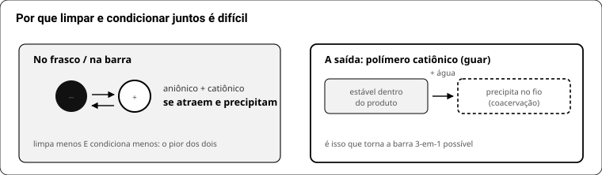
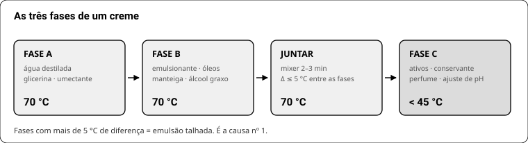

# LIVRO 3 — A química que sustenta todo o resto

## 24. Tensoativos

Molécula com cabeça que gosta de água e cauda que gosta de gordura. **O que muda entre eles é a carga da cabeça** — e só isso já prevê o comportamento.

| Família | Carga | Papel | Exemplos |
|---|---|---|---|
| **Aniônico** | negativa | limpa e espuma — o motor | SCI, lauril sulfato, sabão, SLSA, SCS |
| **Catiônico** | positiva | condiciona: gruda no fio e na pele | BTMS, guar quaternizada, Polyquat-10 |
| **Anfótero** | depende do pH | suaviza e estabiliza espuma | cocamidopropil betaína |
| **Não-iônico** | nenhuma | emulsiona, suaviza, limpa pouco | coco glucoside, Olivem, dimeticona |

**A regra:** aniônico + catiônico **se atraem e precipitam** — perdem limpeza e condicionamento juntos. Anfótero e não-iônico convivem com qualquer um.

Três saídas para limpar e condicionar no mesmo produto:
1. **Polímero catiônico** (guar quaternizada) — estável no produto, precipita no fio ao diluir no enxágue (**coacervação**).
2. **Silicone** — neutro, não briga.
3. **Produtos separados.**

**Sinergia de suavidade:** aniônico + anfótero reduz a irritação dos dois. É por isso que a betaína entra — não para limpar.

## 25. Ácidos graxos: o que cada gordura entrega

| Ácido graxo | Onde está | O que faz na barra |
|---|---|---|
| Láurico + mirístico | coco, babaçu, palmiste | **espuma grande e limpeza forte**; >30% resseca |
| Palmítico + esteárico | palma, karité, cacau, sebo, banha | **dureza e durabilidade** |
| Oleico | oliva, girassol alto oleico, abacate | **maciez**, espuma baixa |
| Ricinoleico | mamona | **turbina espuma cremosa**; >8% deixa pegajoso |
| Linoleico + linolênico | girassol comum, soja, uva | **rançam** (DOS: manchas laranja e cheiro) |

**Os cinco números do SoapCalc** (cold process):

| Número | Vem de | Alvo |
|---|---|---|
| Hardness | láurico+mirístico+palmítico+esteárico | 29–54 |
| Cleansing | láurico+mirístico | **12–22** (acima disso resseca, sem discussão) |
| Conditioning | oleico+linoleico+linolênico+ricinoleico | 44–69 |
| Bubbly | láurico+ricinoleico | 14–46 |
| Creamy | palmítico+esteárico+ricinoleico | 16–48 |
| INS | iodo + saponificação | 136–165 |

## 26. pH

| Produto | Alvo | Por quê |
|---|---|---|
| Pele saudável | 4,7–5,5 | manto hidrolipídico |
| **Syndet, creme, shampoo** | **5,0–5,5** | respeita o manto |
| Couro cabeludo / cabelo | 4,5–5,5 | pH alto abre a cutícula |
| **Sabão (glicerinado e CP)** | **9–10, e não tem jeito** | saponificação exige álcali; abaixo de ~8,5 o sabão se desfaz |

**Medir:** 1 g raspado em 9 g de água destilada (solução a 10%), fita ou pHmetro calibrado.
**Corrigir:** ácido cítrico ou lático baixa; solução de bicarbonato sobe. Em sabão, **não tente** — desmancha.

## 27. Emulsão e HLB

Emulsionante fica na fronteira entre a gota de óleo e a água. **HLB** (0–20) diz para que serve:

| HLB | Tipo | Resultado |
|---|---|---|
| 3–6 | água em óleo (A/O) | creme pesado, oclusivo |
| **8–18** | **óleo em água (O/A)** | leve, absorve — o que você quer |

Autoemulsionantes (Olivem 1000, cera Lanette, Montanov) já vêm balanceados.

**Por que talha:**

| Causa | Sinal | Correção |
|---|---|---|
| Fases com temperatura diferente | separa ao juntar | **as duas a 70 °C, diferença ≤5 °C** |
| Agitação fraca | grânulos | mixer, não colher |
| Emulsionante de menos | separa em dias | 5% loção, 6–8% creme |
| Fase oleosa alta demais | separa em dias | Olivem: fase oleosa **≤22%** |
| Eletrólito demais (sal, extrato) | quebra | entrar aos poucos, na fase fria |

## 28. Água como matéria-prima

- É o ingrediente majoritário de emulsão e shampoo — e o veículo de contaminação.
- **Água destilada ou deionizada**, de farmácia. Torneira traz carga microbiana, cloro e íons que quebram emulsão.
- **Atividade de água (aW)**: micróbio precisa de água livre. Produto anidro (bálsamo, lotion bar) tem aW baixíssima e por isso **não exige conservante** — mas basta um dedo molhado para mudar isso.
- Água aberta em garrafa contamina: use por lote, não guarde meses aberta.

## 29. Conservação

| Conservante | Dose | Faixa de pH | Preço |
|---|---|---|---|
| **Fenoxietanol** | 0,3–1% | 3,0–10,0 | R$ 11,50/100 ml |
| **Sharomix 713** | 0,8–1% | ácido | R$ 10,52/500 g (Atiká) |
| Nipaguard SCE | conforme rótulo | amplo | R$ 18,08/500 g |
| Optiphen Plus | 0,5–1% | ácido a neutro | ~R$ 60 |
| Cosgard / Geogard 221 | 0,2–1% | até ~6 | importado |

**Regras:** entra na **fase fria (<45 °C)**, sob agitação · usar **água destilada** · higienizar tudo com álcool 70% · validade caseira **3 meses**.
**O que NÃO é conservante:** vitamina E, BHT, óleo essencial, álcool em baixa dose, "extrato de semente de toranja". São antioxidantes ou marketing — antioxidante protege gordura de oxidar, não mata micróbio.

## 30. Reologia e espessantes

O "toque" é viscosidade + como ela se comporta sob cisalhamento.

| Espessante | Onde | Efeito |
|---|---|---|
| Álcool cetílico / cetoestearílico | emulsão, barra | corpo, deslize sedoso |
| Ácido esteárico | barra, creme | dureza, toque "arrastado" |
| Goma xantana | fase aquosa | gel, 0,2–1%; em excesso fica "mucoso" |
| Carbômero | gel | gel transparente, precisa neutralizar |
| Sal (NaCl) | shampoo líquido | engrossa sistema aniônico — **curva em sino**: passou do pico, afina de novo |
| Argila, amido | barra | corpo e matificação |

## 31. Corantes e pigmentos

| Tipo | Dose | Comportamento |
|---|---|---|
| **Mica** | 2–4 g/kg | não sangra, não desbota — a escolha certa |
| **Óxido de ferro** | 1,5–2% em base opaca · 0,25–0,5% em transparente | pigmento forte, pouco rende muito |
| Lake / corante hidrossolúvel | — | **sangra** entre camadas, desbota na luz, mancha toalha |
| Corante natural (urucum, argila, carvão) | 1–3% | instável em pH alto; verde de clorofila some no sabão |

**Sempre hidratar o pó** em glicerina ou um pouco de óleo antes de incorporar — pó seco vira pontinho.
Em cold process (pH 10) muita cor natural degrada; mica e óxido aguentam.
