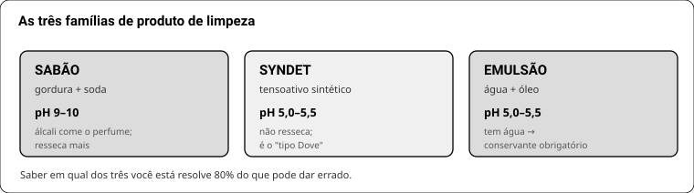
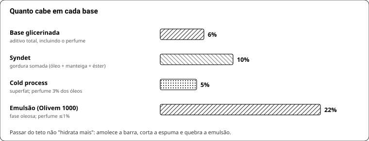
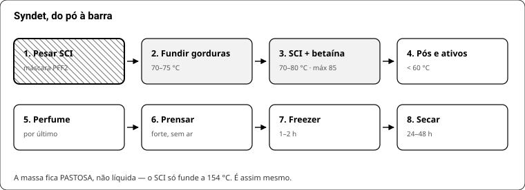

# LIVRO 4 — Sabonete

## 32. As três famílias

| Família | O que é | pH | Consequência |
|---|---|---|---|
| **Sabão** | gordura + álcali (saponificação) | 9–10 | álcali come perfume, resseca mais |
| **Syndet** | tensoativo sintético prensado | **5** | não resseca; é o "tipo Dove" |
| **Emulsão** | água + óleo | 5–5,5 | tem água → conservante obrigatório |

Base glicerinada (melt & pour) é **sabão**, não syndet — apesar do marketing.

## 33. Base glicerinada

- É sabão pronto (INCI típico: *sodium palmate, sodium palm kernelate, sodium tallowate*, glicerina, **álcool**, sorbitol, sacarose).
- **Teto de aditivo: 6% do peso total, sendo no máximo 3% de perfume.** Fontes divergem (fabricante 2–3%, loja 4–6%, guia BR 10–12%) — 6% é a leitura segura.
- O álcool da fórmula é parte do motivo de a barra ser mole. Derreter a **60 °C**, nunca ferver.
- Aditivos a **45–55 °C**. Perfume por último.

Para 200 g: essência 4–6 g · extrato glicerinado 2–4 g · lauril extra **0** · óleo **0**.

| Sintoma | Causa |
|---|---|
| Barra "chora" | glicerina puxando umidade → embrulhar em PVC |
| Mole, derrete na mão | aditivo >6% |
| Bolhas na massa | fogo alto |
| Cheiro fraco | perfume adicionado acima de 60 °C |
| Camadas descolando | segunda camada em cima de base fria → borrifar álcool 70% entre elas |

**Não dá para:** ajustar pH, colocar creme, endurecer de forma confiável. Serve como bancada de teste de cheiro (R$ 3,60/barra, pronta em 24 h).

## 34. Syndet do zero — a fórmula

1 kg = 10 barras.

| Material | % | Papel | Teto |
|---|---|---|---|
| SCI | 50 | espuma densa, pH 5 | **50% (máx. rinse-off)** |
| Ácido esteárico | 9 | dureza + "lipídio de sacrifício" | 10–15% |
| Amido de arroz/milho | 8 | efeito seco | ~8% |
| Cocamidopropil betaína | 7 | umedece o pó, estabiliza espuma | 10% |
| Karité/cacau | 5 | emoliência | gordura total ≤10% |
| Álcool cetílico | 4 | dureza sedosa | 5–15% |
| Coco glucoside | 4 | espuma macia (opcional) | — |
| Perfume | 3 | — | 3% |
| Glicerina + extrato | 3 | umectante | 3–5% |
| Coco caprilato | 3 | toque seco (opcional) | 5% |
| Pantenol | 2 | hidrata sem matar espuma | 2% |
| Caulim | 2 | deslize, matte | 3% |
| Conservante | 0,7 | a barra vive molhada | — |
| Ácido cítrico | 0,3 | fecha pH 5,0–5,5 | 0,5% |

**Processo:** pesar SCI com **máscara PFF2** → fundir esteárico+cetílico+manteiga a **70–75 °C** → juntar SCI+betaína a **70–80 °C, nunca >85 °C** (degrada espuma) → massa fica **pastosa, não líquida** (SCI só funde a 154 °C) → abaixo de 60 °C entram pós, pantenol, cítrico, conservante e **por último o perfume** → **prensar** → freezer 1–2 h → secar 24–48 h (3–7 dias melhor).

**3-em-1:** + guar quaternizada 2–3% (tirar do amido), **hidratada em água morna antes**.

| Defeito | Causa | Correção |
|---|---|---|
| Esfarela | ligante de menos; polímero catiônico demais; SCI em noodle | subir esteárico/cetílico; usar **SCI em pó** |
| Mole | glicerina/líquido demais | cortar glicerina, subir álcool cetílico |
| Não desenforma | esfriou devagar | freezer logo após prensar |
| Espuma fraca | SCI baixo, ou água dura | subir SCI |
| Espuma some | gordura >10% | cortar manteiga/óleo |
| Arde | pH >6 | ácido cítrico |

**Custo (Atiká):** base R$ 37,65/kg → **R$ 4,60–5,80 a barra de 100 g** com perfume.

## 35. Soda cáustica — protocolo

NaOH sólido + água libera calor: a solução chega a **~90 °C sozinha** e solta vapor irritante nos primeiros minutos.

1. **EPI:** óculos de proteção fechados (não óculos de grau), luvas, manga longa, sapato fechado.
2. **Área ventilada**, sem criança nem animal. Bancada limpa.
3. **Soda NA água, nunca água na soda.** Invertido, ferve e espirra.
4. **Nada de alumínio** — reage. Só inox, vidro grosso (borossilicato) ou PP.
5. Adicionar devagar, mexendo, com o rosto virado. Deixar esfriar em local seguro, identificado.
6. **Respingo na pele: muita água corrente**, por vários minutos. Nos olhos: água corrente + emergência.
7. Armazenar em recipiente fechado, identificado, longe de ácido e de alimento.
8. Pureza mínima **97%**, sem aditivo.

## 36. Cold process

**Toda receita passa por calculadora** (SoapCalc, Casa do Saboeiro, Fórmula Sabão Artesanal). Receita copiada sem recalcular é o erro que machuca — cada óleo tem índice de saponificação diferente.

Receita de referência, 1 kg de óleos (~14 barras):

| Gordura | % | Papel |
|---|---|---|
| Sebo ou banha | 35 | dureza + espuma cremosa, e é o mais barato |
| Coco ou babaçu | 25 | bolha grande (>30% resseca) |
| Azeite / girassol alto oleico | 25 | suavidade |
| Manteiga de cacau | 10 | dureza |
| Mamona | 5 | turbina espuma |

Soda ~143 g (superfat 5%), água ~290 g (concentração 33%) — **confira na calculadora**.

**Aditivos:** açúcar 2 col. chá dissolvido na água **antes** da soda (espuma) · lactato de sódio 2 col. chá (dureza, desenforma) · caulim 2 col. sopa (deslize, ajuda a fixar perfume) · perfume 3% dos óleos, **no traço, a 38–43 °C**.

**Processo:** soda na água → esfriar a 38–43 °C → gorduras derretidas a 38–43 °C → juntar → mixer até **traço leve** → aditivos → molde → 24–48 h → cortar → **curar 4 a 6 semanas** em grade arejada.

**A cura não é opcional:** evapora água, endurece e suaviza. Barra de 2 semanas arde e derrete.

| Defeito | Causa |
|---|---|
| Endurece na hora (*seize*) | fragrância aceleradora ou temperatura alta |
| Grãos de arroz (*ricing*) | incompatibilidade da fragrância |
| Manchas laranja + ranço (*DOS*) | óleo linoleico/linolênico, superfat alto, óleo velho |
| Escurece | vanilina |
| Arde depois da cura | soda mal calculada → descartar |

**Custo:** ~R$ 3,50/barra. **pH 9–10 sempre.**

## 36b. Sabonete líquido

Mesma química do syndet, em água.

| Material | % | Papel |
|---|---|---|
| Água destilada | q.s.p. | veículo |
| Tensoativo aniônico (SLES, SCI líquido, sarcosinato) | 8–15% **de ativo** | limpeza |
| Cocamidopropil betaína | 3–5% | suavidade e espuma |
| Coco glucoside | 2–4% | maciez |
| Glicerina | 2–3% | umectante |
| Guar quaternizada *(se for 2-em-1)* | 0,2–0,5% | condiciona |
| **EDTA / fitato** | 0,1–0,2% | espuma em água dura |
| **Conservante** | 0,5–1% | **obrigatório** |
| Ácido cítrico | q.s. | pH **5,0–5,5** |
| **NaCl** | 0,5–3% | espessa — **curva em sino** |
| Perfume | 0,5–1% | menos que na barra (o produto é diluído) |

**Ordem:** dissolver quelante e glicerina na água → tensoativos devagar, **sem criar espuma** (mexer no fundo) → ajustar pH → só então o sal, de 0,2% em 0,2%, medindo a viscosidade → conservante e perfume por último → descansar 24 h para as bolhas subirem.

**Erros:** bater com mixer (vira espuma que não baixa em dias) · pôr o sal antes de acertar o pH (a curva muda) · esquecer o quelante (espuma some em água dura).

## 37. Efeito seco × hidratação × espuma

Os três brigam. Como equilibrar:

| Quero | Quem entrega | O que ele atrapalha | Solução |
|---|---|---|---|
| Espuma | SCI, láurico, betaína, mamona | gordura derruba | gordura total ≤8–10% |
| Hidratação | manteiga, glicerina, pantenol | manteiga corta espuma | hidratar com **pantenol + glicerina**, não com óleo |
| Efeito seco | amido 8%, caulim 2%, coco caprilato | pó demais = barra arenosa | ficar nas doses |
| Perfume | 3% | acima disso amolece | 3% e escolher molécula substantiva |

**A sacada:** numa barra, **óleo não hidrata** — é enxaguado. Quem hidrata é o **tensoativo suave em pH 5** (não arranca o manto) + o **ácido esteárico**, que se deposita como lipídio de sacrifício.
