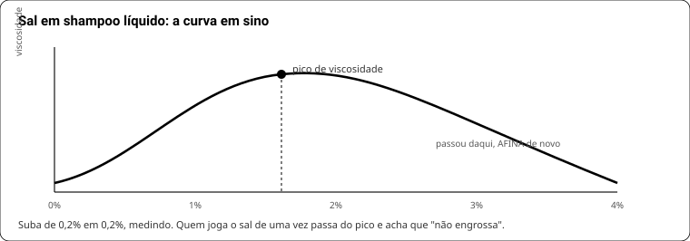

# LIVRO 5 — Cabelo, barba e produtos anidros

## 38. Barras capilares

### 38.1 Shampoo sólido — fórmula (500 g)

| Material | % | g | Papel |
|---|---|---|---|
| SCI pó | 40 | 200 | limpeza e espuma |
| Ácido esteárico | 10 | 50 | dureza |
| Álcool cetílico | 6 | 30 | deslize |
| Cocamidopropil betaína | 8 | 40 | espuma + suavidade |
| **Guar quaternizada** | 2 | 10 | desembaraça (hidratar antes) |
| Amido de arroz | 6 | 30 | tira pegajosidade |
| Óleo de rícino | 3 | 15 | brilho, espuma cremosa |
| Pantenol | 2 | 10 | corpo e maciez |
| Glicerina | 2 | 10 | umectante |
| Perfume | 3 | 15 | — |
| Conservante | 0,7 | 3,5 | a barra vive molhada |
| Ácido cítrico | q.s. | ~1,5 | fechar **pH 4,5–5,5** |

**Ajustes por tipo de cabelo:** oleoso → SCI 45%, gordura ≤5% · seco/cacheado → SCI 30%, manteiga 5%, guar 3%.
**Gordura total ≤7%** — em cabelo, gordura pesa e tira volume.

**Transição:** dias a poucas semanas ao sair do shampoo líquido. Não é a fórmula falhando. Se o cabelo ficar "pesado e opaco", quase sempre é **água dura** — enxágue final com solução de ácido cítrico a 1% resolve.

### 38.2 Condicionador sólido — fórmula (200 g)

| Material | % | g | Papel |
|---|---|---|---|
| **BTMS-50** | 30 | 60 | o condicionamento de verdade |
| **Álcool cetílico** | 25 | 50 | deslize sedoso |
| Manteiga de cacau ou kokum | 15 | 30 | corpo, dureza |
| Óleo (jojoba, argan) | 5 | 10 | brilho |
| Pantenol | 2 | 4 | maciez |
| Perfume | 1 | 2 | — |
| Conservante | 1 | 2 | — |
| Amido / sílica | resto | ~42 | estrutura e toque |

Fundir tudo a ~70 °C · esfriar até ~57 °C · entrar perfume e conservante · prensar · freezer 1 h · secar 24 h.
**Não troque álcool cetílico por esteárico** — esteárico "arrasta" o pente; cetílico desliza.
**BTMS-25 ≠ BTMS-50**: metade do ativo. Se só tiver o 25, use ~1,8× a quantidade.

### 38.3 A barra 3-em-1

O conflito aniônico × catiônico é real (cap. 24). A saída é **coacervação**: a guar quaternizada fica estável na barra e **precipita no fio quando diluída no enxágue**.

Pegue a fórmula do syndet (cap. 34) e acrescente **guar quaternizada 2–3%**, tirando do amido.
**Passo crítico:** hidratar a guar em água morna (1:10) até virar gel **antes** de juntar. Guar seca jogada na massa vira bolinha que não desfaz e aparece como ponto branco na barra.

| Serve para | Não serve para |
|---|---|
| corpo, barba, cabelo **curto** | cabelo longo |
| uso diário, viagem | cabelo tingido ou danificado |
| quem quer um produto só | quem precisa de máscara/reconstrução |

## 39. Barba

Dois substratos ao mesmo tempo: **o pelo** (queratina, quer pH ácido) e **a pele embaixo** (quer tensoativo suave em pH 5).

| Erro comum | O que acontece |
|---|---|
| Sabonete corporal no rosto | pH 9–10 altera a barreira → vermelhidão, descamação, "caspa da barba" |
| Shampoo comum de supermercado | tensoativo agressivo resseca a pele sob a barba |
| Lavar 2× ao dia | remove o sebo que protege o pelo; a barba fica áspera |

**Rotina que funciona:** barra syndet pH 5 com guar, **1× ao dia** → secar sem esfregar → **óleo de barba leve** com o pelo ainda úmido.

**Óleo de barba (30 ml):** jojoba 50% · esqualano 20% · amêndoa doce 20% · rícino 10% · perfume **≤1%**.
Jojoba é cera líquida: não rança e é o mais parecido com o sebo humano. Rícino dá brilho e peso — acima de 15% gruda.

## 40. Quando o produto é líquido

| Item | Regra |
|---|---|
| Sistema tensoativo | aniônico 8–15% de **ativo** + anfótero 2–5% + não-iônico 1–3% |
| **Espessamento com NaCl** | **curva em sino**: engrossa até um pico e depois **afina de novo**. Subir de 0,2% em 0,2%, anotando |
| Espessante alternativo | goma xantana 0,3–0,8% (não tem pico) |
| Condicionador líquido | BTMS 3–5% + álcool cetílico 2–4% + água; **nunca junto de aniônico** |
| pH | shampoo 5,0–5,5 · condicionador 4,0–5,0 · sabonete líquido 5,0–5,5 |
| Conservante | **obrigatório** — é quase tudo água |
| Quelante | EDTA ou fitato 0,1–0,2% em água dura |
| Pérola/opacificante | glicol distearato 1–2% |

**Líquido × sólido:** líquido é mais barato de produzir e mais fácil de errar na conservação; sólido tem frete menor, apelo de embalagem e validade maior (menos água = menos risco).

## 41. Produtos anidros

| Produto | Estrutura | Textura | Cuidado |
|---|---|---|---|
| **Óleo de barba / corporal** | 100% óleos + perfume ≤1% | líquido | antioxidante (vit. E 0,2%) |
| **Bálsamo** | óleo 60–70% + manteiga 20–30% + cera 5–10% | firme, derrete na mão | resfriar rápido |
| **Lotion bar** | cera 1 : manteiga 1 : óleo 1 | sólido, derrete na pele | acima de 28 °C amolece |
| **Manteiga chicoteada** | manteiga 70–80% + óleo 20–30%, batida fria | fofa | derrete acima de 25 °C — não manda pelo correio no verão |
| **Bastão labial** | cera 25–30% + manteiga 30% + óleo 40% | duro | "teste de bolso": 1 h a 30 °C sem entortar |
| **Esfoliante de óleo** | açúcar/sal 60–70% + óleo 30–40% | pastoso | **recebe água no uso → conservante** |

**Ceras, comparadas:**

| Cera | Fusão | Dureza | Nota |
|---|---|---|---|
| Abelha | ~62 °C | média, plástica | pegajosa acima de 10% |
| Candelilha | ~70 °C | alta, vegana | usar ~½ da quantidade de abelha |
| Carnaúba | ~83 °C | muito alta | 1–3% já muda tudo; acima disso fica quebradiça |

**Processo:** fundir em banho-maria · perfume **abaixo de 50 °C** · **resfriar rápido** (geladeira) para evitar cristal granulado — é o que causa a manteiga de karité "arenosa".
Se der arenoso: refundir a 75 °C por 20 min e resfriar em choque térmico.

## 42. A regra do anidro

**Sem água livre, micróbio não cresce.** Produto anidro dispensa conservante.

**As três exceções — e é onde as pessoas se queimam:**
1. **Dedo molhado no pote**, no banheiro. Introduz água e nutriente. → conservante de amplo espectro mesmo sendo anidro, ou **embalagem sem contato** (bisnaga, stick, airless).
2. **Usado no banho** (lotion bar, esfoliante de óleo) → sempre com conservante.
3. **Ingrediente que carrega água escondida**: mel, aloe, hidrolato, extrato aquoso, leite em pó reidratado.

**Antioxidante ≠ conservante.** Em anidro se usa **vitamina E ou BHT 0,1%** contra ranço — isso protege a gordura de oxidar, **não** mata micróbio.

| Produto | Conservante? | Antioxidante? |
|---|---|---|
| Óleo de barba | não | **sim** |
| Bálsamo em pote aberto com dedo | **sim** | sim |
| Bálsamo em stick | não | sim |
| Esfoliante de óleo e açúcar | **sim** | sim |
| Manteiga chicoteada em pote | **sim** (dedo) | sim |
| Barra de syndet | **sim** (fica molhada) | não precisa |
