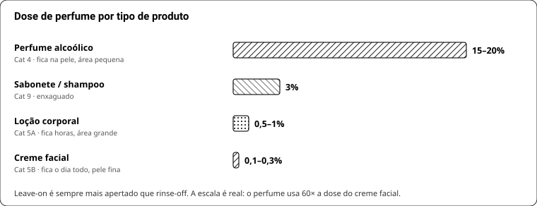

# LIVRO 7 — Perfumar o produto

## 47. Por que é outro problema

Perfume em álcool: o veículo evapora e entrega tudo na pele. Em cosmético, três coisas mudam:

1. **O produto tem estrutura** — emulsão, cristal de tensoativo, sabão. O perfume é solvente e pode desestabilizar.
2. **O pH é outro** — sabão a 9–10 degrada material; syndet e creme a 5 não.
3. **O produto é enxaguado** (ou fica horas na pele) — o que muda quem sobrevive e qual é o limite legal.

## 48. Dose e categoria

| Produto | Categoria IFRA | Dose prática |
|---|---|---|
| Perfume alcoólico | 4 | 15–20% |
| **Sabonete, shampoo (rinse-off)** | **9** | **3%** |
| Loção corporal | 5A | 0,5–1% (indústria até 1–2%) |
| **Creme facial** | **5B** | **0,1–0,3%** |
| Desodorante | 5D/8 | conferir por material |

Leave-on é sempre mais apertado: o produto fica horas na pele, em área maior.
Em 50 g de creme a 0,2%, o perfume inteiro são **0,1 g** — trabalhe com balança de 0,001 g ou com o perfume diluído a 10%.

## 49. Substantividade — o que sobra depois do enxágue

| Fica | Vai pro ralo |
|---|---|
| **Almíscares** (Galaxolide, Habanolide, Exaltolide, etileno brassilato, Ambrettolide) | cítricos e terpenos |
| **Âmbar** (Ambroxan, Ambrox DL) | aldeídos leves |
| **Amadeirados** (Iso E Super, Cashmeran, Javanol) | notas verdes e aquáticas |
| Cumarina, vanilina, ionona, benzil salicilato | florais frágeis |

O topo não é desperdício — é o que se sente ao abrir a embalagem e no primeiro instante da espuma. Só não gaste material caro nele.

**Acorde "sabonete limpo" barato, para 1 kg de produto a 3% (30 g):**
Galaxolide 35% · etileno brassilato 15% · Iso E Super 15% · Habanolide 10% · Hedione 10% · Ambroxan 5% · topo cítrico 10%. **≈ R$ 8,45/kg** — R$ 0,85 por barra de 100 g.

## 49b. Quanto tempo o cheiro dura depois do banho

Estimativas de uso real, não medição de laboratório:

| Produto | Perceptível de perto | O que estende |
|---|---|---|
| Sabonete comum (glicerinado, cítrico) | **10–20 min** | nada: o topo foi para o ralo |
| Sabonete bem formulado (musk + âmbar, 3%) | **30 min – 2 h** | almíscar e âmbar, que grudam na queratina |
| Barra + loção no mesmo acorde | **4–6 h** | a loção é leave-on: ela é quem segura |
| Perfume alcoólico por cima | 6–10 h | o acorde inteiro, em dose 5× maior |

**A conclusão prática:** ninguém sente seu sabonete no fim do dia — nem o mais caro do mercado. O que faz
o cheiro "durar do banho até a noite" é **camada**: a mesma família no sabonete, na loção e no perfume.
É por isso que marca de luxo vende a linha inteira, e não porque o sabonete dela fixa mais.

## 50. Interação fragrância × base

| Fenômeno | Onde | Causa | O que fazer |
|---|---|---|---|
| **Aceleração / seize** | cold process | especiados, floral pesado, alguns sintéticos | temperatura mais baixa, mexer à mão, molde pronto |
| **Ricing** (grãos) | cold process | incompatibilidade do veículo da fragrância | mixar mais; trocar a fragrância |
| **Escurecimento** | CP e M&P | **vanilina e etil vanilina** | aceitar, ou usar "vanilla stable"; nunca em barra branca |
| **Descoloração / manchas** | todos | cítrico oxidado, ferro na água | quelante (EDTA), óleo fresco |
| **Perda de cheiro** | CP | álcali destrói topo | ancorar em base; perfume no traço, 38–43 °C |
| **Barra suando** | M&P | solvente da essência + glicerina | essência ≤3%, embrulhar |
| **Emulsão quebrando** | creme | perfume entrou quente ou demais | entrar <45 °C, ≤1% |
| **Conservante inativado** | creme | alguns materiais e polissorbatos sequestram o conservante | não passar da dose de perfume; testar estabilidade |
| **Oxidação do terpeno** | todos | limoneno/linalol + ar | BHT/tocoferol, frasco cheio |

## 51. Adaptar uma fórmula alcoólica

**Regra prática validada:** multiplicar o **topo por 0,5** e os **almíscares/âmbar por 1,8**, depois renormalizar para 100%.

Exemplo, o Imagination (tipo) do repo:

| Material | Original | Versão sabonete | Em 30 g (1 kg de produto) |
|---|---|---|---|
| Ambroxan | 21,68% | **33,92%** | 10,175 g |
| Hedione | 23,88% | 20,75% | 6,226 g |
| Ambrettolide | 7,59% | **11,88%** | 3,564 g |
| Dihidro beta ionona | 9,79% | 8,51% | 2,553 g |
| Velvione | 3,50% | **5,47%** | 1,641 g |
| Acetato de linalila | 10,29% | 4,47% | 1,342 g |
| Exaltolide Total | 2,70% | **4,22%** | 1,266 g |
| Bergamota | 7,59% | 3,30% | 0,990 g |
| Linalol | 4,10% | 1,78% | 0,534 g |
| Terpenos de laranja | 3,30% | 1,43% | 0,430 g |
| Guaiacwood · citronelol · cumarina · gengibre · demais traços | ~5,6% | ~4,3% | 1,28 g |

**Custo: R$ 42,70/kg.** Ambrettolide (R$ 5,46/g) e Velvione (R$ 7,36/g) são 60% da conta.
**Versão econômica:** tirar o Velvione e metade do Ambrettolide, pôr Galaxolide 8% + etileno brassilato 4,4% → **R$ 19,90/kg** (R$ 1,99/barra). Perde a elegância do macrocíclico; em produto enxaguado, não se percebe.

**Checklist antes de fechar:**
1. Categoria IFRA certa e limite de cada material conferido.
2. Alérgenos acima do gatilho listados para o rótulo (0,001% leave-on / 0,01% rinse-off).
3. Nada fototóxico em leave-on de rosto (cítrico prensado → usar FCF).
4. Teste de 100 g antes do lote.
5. Cheirar **o produto**, não a fórmula: 24 h depois de pronto e 7 dias depois.

## 51b. Onde e como o perfume entra, produto por produto

| Produto | Dose | Entra quando | Como incorporar | Armadilha |
|---|---|---|---|---|
| **Base glicerinada** | 2–3% | 45–55 °C, por último | direto, mexendo devagar | acima de 60 °C o topo evapora; acima de 3% a barra sua |
| **Syndet** | 3% | <60 °C, por último | direto na massa pastosa | calor alto degrada espuma e cheiro |
| **Cold process** | 3% dos óleos | **no traço**, 38–43 °C | direto, mexendo à mão | fragrância aceleradora dá *seize* em segundos |
| **Creme / loção** | 0,5–1% corpo · 0,1–0,3% rosto | fase C, <45 °C | **dissolver antes** em parte do óleo ou do esqualano | jogado no creme frio vira bolinha |
| **Sabonete líquido / shampoo** | 0,5–1% | no fim, com o produto frio | **polissorbato 20**, 1–3× o peso do perfume | sem solubilizante, turva e separa |
| **Body splash / bruma** | 1–3% | no fim | solubilizante obrigatório | água + óleo = leitoso |
| **Óleo de barba / corporal** | ≤1% | qualquer momento | direto (tudo é óleo) | dose alta irrita a pele do rosto |
| **Bálsamo / stick** | 0,5–1% | <50 °C | direto | cera quente evapora o topo |
| **Condicionador** | 0,3–0,8% | <50 °C | direto | catiônico + perfume ácido pode turvar |
| **Vela** *(fora do escopo de pele)* | 6–10% | 60–65 °C | direto | IFRA categoria 12 |

**Três regras que valem para todos:**
1. **Perfume entra por último e frio.** Cada 10 °C a mais dobra a evaporação — você paga pelo material e ele vai para o ar.
2. **Produto com água precisa de solubilizante.** Perfume é óleo.
3. **Cheire o produto, não a fórmula.** O mesmo acorde muda em base alcalina, em pH 5 e em emulsão. Avalie 24 h e 7 dias depois de pronto.
