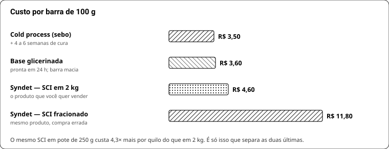
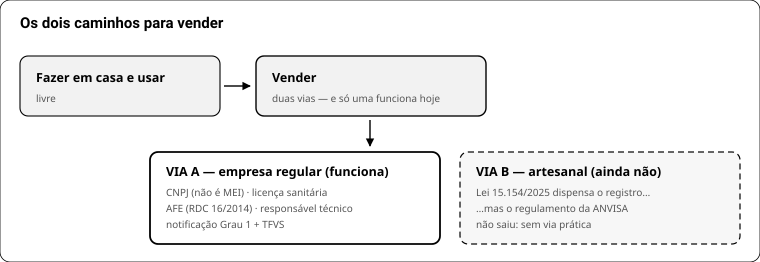

# LIVRO 9 — Virar negócio

## 56. Do lote de bancada ao lote de produção

O que muda quando sai de 200 g para 5 kg:

| Variável | Bancada | Produção |
|---|---|---|
| Aquecimento | banho-maria | massa maior demora mais e **retém calor** — o perfume evapora se entrar cedo |
| Resfriamento | rápido | lento → cristal grosseiro em syndet e karité "arenoso"; resfriar ativamente |
| Agitação | mixer de mão | zonas mortas: mexer o fundo e as bordas |
| Pesagem | 0,001 g | erro relativo cai, mas o absoluto sobe: confira duas vezes o material de traço |
| Perda de processo | ignorável | 3–8% fica na panela → **formule com 5% de folga** |
| Reprodutibilidade | "ficou bom" | **caderno de lote obrigatório** |

**Escale sempre em múltiplos inteiros** e refaça um lote intermediário antes de saltar 10×.

## 57. Custo e preço

**Custo total = matéria-prima + indiretos + mão de obra.**

1. Matéria-prima por unidade = custo do lote ÷ unidades. Syndet hoje: ~R$ 3,77 + perfume R$ 0,85–1,99 = **R$ 4,60–5,80**.
2. Indiretos: embalagem, rótulo, energia, gás, **frete diluído** por unidade.
3. Mão de obra: sua hora × horas do lote ÷ unidades. **É o item que todo artesão esquece.**
4. **Preço = custo total × 2** (markup de 100%; a faixa usual do artesanato é 50–100%).

Exemplo: R$ 4,60 material + R$ 2,00 indiretos + R$ 1,50 mão de obra = R$ 8,10 → **venda R$ 16**.
Se o mercado não paga, **não corte material**: aumente o lote (o custo por barra despenca do segundo lote em diante) ou suba o valor percebido: rótulo, história, e um acorde que só você tem.

## 58. Regularização — via A: empresa regular

É o caminho que existe hoje, com via procedimental funcionando.

| Etapa | O que é |
|---|---|
| **CNPJ com CNAE de fabricação** | saboaria **não cabe em MEI** |
| **Licença sanitária** local | vigilância municipal/estadual |
| **AFE — Autorização de Funcionamento** | ANVISA, **RDC 16/2014**; obrigatória para fabricar, importar, embalar, distribuir |
| **Responsável técnico** | **Lei 6.360/1976, art. 53** — profissional habilitado |
| **Notificação Grau 1** ou **registro Grau 2** | sabonete, shampoo e creme comum são **Grau 1** |
| **BPF** | verificada por inspeção sanitária |

## 59. Regularização — via B: artesanal

- **Lei 15.154/2025** (publicada em 01/07/2025, em vigor desde 30/08/2025) altera a Lei 6.360 e **dispensa o registro** de cosmético, perfume e produto de higiene artesanal.
- **O regulamento da ANVISA ainda não foi publicado.** A **Consulta Pública nº 1.353/2025** foi reaberta e encerrou em fev/2026 sem texto final.
- A minuta propõe: definição de artesanal por processo predominantemente manual e baixo risco · dispensa de registro com **comunicação prévia de comercialização** · rotulagem mínima com a expressão **"PRODUTO ARTESANAL"** · BPF simplificadas · **sem exigência de responsável técnico**.
- **A dispensa de RT está na minuta, não na lei** — e é disputada (os CRQs defendem manter o químico como RT).

**Tradução:** a isenção existe no papel e **não tem via procedimental**. Enquanto o regulamento não sai, quem quer vender com segurança jurídica usa a via A. Fazer em casa, usar e presentear é livre.

## 60. Notificação Grau 1, na prática

1. **Cadastrar a empresa** no portal da ANVISA (acesso ao Peticionamento Eletrônico / Solicita).
2. **Declarar o porte** da empresa — é o que define o valor da taxa.
3. Preencher o **formulário de notificação** (fórmula, rotulagem, finalidade) e anexar o checklist.
4. Gerar a **TFVS** (taxa de fiscalização; valor pela Portaria Interministerial 701/2015) → **GRU**.
5. **Pagar a GRU.** Só depois do pagamento o sistema gera o protocolo.
6. Grau 1 é **automático**: sem análise prévia. O sistema confere por parâmetros se o enquadramento está certo — enquadrar errado é o erro que gera problema depois.

## 61. Boas práticas e rastreabilidade

O mínimo defensável, mesmo antes de ser obrigado:

- **Caderno/planilha de lote**: número, data, fórmula, fornecedor e lote de cada insumo, pH, rendimento, quem fez.
- **Amostra de retenção** de cada lote, guardada até o fim da validade.
- Área de produção separada de cozinha e de animal; superfícies laváveis.
- Insumo identificado, com validade, em embalagem fechada.
- Água destilada, higienização com álcool 70% registrada.
- **Recall**: se um lote der problema, o caderno é o que permite saber quais unidades saíram e para quem.

## 62. Rótulo

Obrigatório: **nome do produto · finalidade · composição em INCI (ordem decrescente) · conteúdo · lote · validade · modo de uso · advertências · número de notificação quando aplicável · razão social, CNPJ e endereço · SAC**. Regra vigente: **RDC 907/2024** (que revogou a RDC 752/2022).

Mais: **alérgenos de fragrância** declarados pela RDC 530/2021 (26 substâncias, acima de 0,001% leave-on e 0,01% rinse-off).

INCI é nome internacional, não português: *Aqua*, não "água"; *Sodium Cocoyl Isethionate*, não "SCI"; *Butyrospermum Parkii Butter*, não "karité". Fragrância entra como **Parfum**, seguida dos alérgenos declaráveis.

> Pendência honesta: a norma de **BPF** de cosméticos é distinta da RDC 907/2024 (que trata de classificação, rotulagem, embalagem, microbiologia e regularização). A referência mais citada é a **RDC 764/2022** — confirme o número na base da ANVISA antes de citá-lo em documento oficial.
