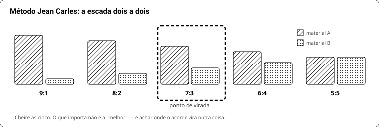

# LIVRO 12 — Virar perfumista: o programa de 12 meses

Este é o currículo que o kit-escola da **versão 5** (Livro 11) serve. Não é teoria: é o que fazer em
cada semana, com quais frascos, e como saber que você pode passar para o mês seguinte.

O método é o de **Jean Carles**, perfumista-chefe da Roure, que treinou boa parte da geração que fez
a perfumaria francesa do século XX — e que ficou cego no fim da vida, continuando a compor. O
programa clássico da PerfumersWorld, de 12 meses, é a versão moderna dele.

**A promessa, medida:** em 12 meses você reconhece cegos **os 110 materiais da sua caixa**, monta
acordes que se sustentam, e entrega **um perfume acabado** — engarrafado, filtrado, estável e dentro
dos limites IFRA.

**O que isso não é.** Um perfumista de casa domina 300 a 500 materiais, formula dentro de produto
(sabonete, creme, vela, não só álcool) e lê análise de lote. Doze meses caseiros entregam **um bom
provador e um formulador de acordes** — que é o degrau de onde se sobe, não o topo. Quem promete mais
está vendendo.

## 0. Segurança — leia antes de abrir o primeiro frasco

Isto não é capítulo de encerramento. Material aromático concentrado é corrosivo, sensibilizante e
inflamável, e você vai manusear 110 deles em casa.

**O que você precisa ter, antes do primeiro frasco:**

| Item | Por quê |
|---|---|
| Luva de **nitrila** (não látex) | látex não segura solvente aromático; nitrila segura |
| Óculos de proteção | cinamaldeído e aldeídos no olho são emergência médica |
| Ventilação cruzada | janela aberta e ar circulando. Não é "dá pra fazer no quarto" |
| Extintor ou balde de areia | álcool de cereais pega fogo e queima com chama quase invisível |
| Bancada só para isso | nada de comida, criança ou animal no mesmo ambiente |

**A FISPQ (ficha de segurança) de cada material.** Toda loja é obrigada a fornecer. Baixe e guarde
numa pasta — é lá que está o que fazer se cair no olho, quanto tempo lavar, e se aquele material é
sensibilizante. Material sem FISPQ disponível é material que você não compra.

**Emergência, o que fazer:**

| Aconteceu | Faça |
|---|---|
| Caiu na pele | lave com água e sabão 15 min. **Não** use álcool: ele carrega o material para dentro |
| Caiu no olho | água corrente 15 min, olho aberto, e procure atendimento. Leve a FISPQ |
| Derramou | ventile, absorva com papel, descarte em saco fechado. Não varra seco |
| Pegou fogo | abafe. Água espalha álcool em chamas |

**Descarte.** Álcool e aromático **não vão para a pia** — contaminam água e a rede não trata isso.
Junte os restos num frasco rotulado "resíduo aromático" e leve a um ponto de coleta de resíduo
químico. Enquanto o volume for pequeno, deixar evaporar em local ventilado é aceitável; jogar fora
não é.

**Rotule TODA diluição** com nome, concentração, solvente e data. Frasco sem rótulo é frasco perdido
— e, quando você tiver 110, "eu lembro qual é" deixa de ser verdade em uma semana.

**Nunca teste na pele** um material que você não sabe se é sensibilizante, nem uma fórmula sem ter
checado os limites IFRA. Fita olfativa existe exatamente para isso. E **"natural" não significa
seguro**: óleo essencial de canela e de cravo estão entre os mais sensibilizantes que existem.

**Validade e oxidação.** Cítrico prensado oxida em meses e vira alergênico; aldeído amarelece.
Anote a data de abertura de cada frasco. Material oxidado não é só ruim de cheiro — é mais irritante
que o fresco.

## 1. As cinco regras que não se quebram

1. **Escreva antes de olhar o rótulo.** Ver o nome antes de cheirar treina memória de leitura, não
   de olfato. Quem pula isso demora o dobro e não percebe.
2. **Releia em 24 horas.** Todo material muda. O que você anotou no primeiro minuto é o topo; o que
   importa na fórmula é o que sobra no dia seguinte.
3. **Uma pipeta por material, sem exceção.** A que tocou indol contamina o próximo frasco para
   sempre — e você vai passar semanas achando que enlouqueceu.
4. **Cego toda semana.** Sem teste cego, você aprende a reconhecer o rótulo. Errar cego no começo é
   o esperado; não fazer cego é o erro.
5. **Pare na décima fita.** Depois disso o nariz não decide mais nada, e o que você anotar é ruído
   que vai poluir o caderno.

## 2. Como cheirar, tecnicamente

| O quê | Como |
|---|---|
| A fita | papel absorvente **sem cheiro**, cortada em ponta. Molhe 5 mm, não mais |
| A diluição | **10% em álcool** para quase tudo; 1% para os potentes (aldeídos, indol, damascones, rose oxide) |
| A distância | 2 a 3 cm do nariz. Encostar satura na hora |
| O tempo | 2 a 3 fungadas curtas, e afaste. Fungada longa não aumenta informação |
| Entre materiais | 30 a 60 s de **ar limpo**. Café e o próprio braço são folclore |
| A sessão | no máximo 10 fitas, uma vez por dia |
| A releitura | 1 min · 1 h · 24 h · 7 dias. Anote as quatro |

**Quando não avaliar:** com fome, gripado, depois de fumar, com perfume no corpo, em ambiente com
comida, ou depois de 10 fitas. Nariz cansado formula errado, e você só descobre seis semanas depois,
quando a maceração termina.

**Anosmia específica não é fraqueza sua.** 30 a 50% das pessoas não sentem certos almíscares
macrocíclicos, e a taxa para Iso E Super também é alta. Se um material "não cheira nada", peça a
outra pessoa antes de concluir que o frasco veio fraco.

## 3. O caderno

Sem caderno não há programa — há cheirada. Duas fichas, e só.

**Ficha de material** (uma por frasco, preenchida nas quatro releituras):

```
MATERIAL ...... Iso E Super                  CAS ......... 54464-57-2
FORNECEDOR .... Eu Perfumista                LOTE ........ (do rótulo)
DILUÍDO EM .... 03/10/2026, álcool 10%       VENCE ....... 03/04/2027
FAMÍLIA ....... amadeirada                   DOSE USUAL .. 5 a 40%
TENACIDADE .... ainda na fita em 7 dias      →  BASE

1 minuto ..... transparente, seco, quase nada
1 hora ....... cedro empoeirado, volume sem cheiro próprio
24 horas ..... ainda lá, muito baixo
7 dias ....... presente na fita

TEMPERATURA ..... frio        TEXTURA ..... seco
PESO ............ leve        DOÇURA ...... nenhuma
BRILHO .......... radiante    CARÁTER ..... mineral, amadeirado

DESCRIÇÃO EM UMA LINHA: amadeirado transparente, radiante, quase inodoro de perto
DEFEITO: some se usado abaixo de 5%
COM O QUE COMBINA: tudo — é volume, não cheiro
```

**Por que CAS, lote e validade.** O CAS é o nome real do material — "Sandalore" e "Sandela" são
marcas, o CAS não muda. O lote importa porque fornecedor troca lote e o material muda: sem anotar,
você vai passar semanas achando que o seu nariz piorou. E a validade importa porque **diluição
vence**:

| Diluição de | Dura | Sinal de que virou outro material |
|---|---|---|
| Cítrico prensado, aldeído | **3 a 4 meses** | amarela, fica áspero, arranha o nariz |
| Floral, verde, especiaria | 6 a 12 meses | perde o topo |
| Amadeirado, âmbar, almíscar, resina | 1 a 2 anos | quase não muda |

Num programa de 12 meses isso não é detalhe: **os cítricos que você diluiu no mês 1 estarão oxidados
no cego do mês 12**, e você vai reprovar por causa do frasco, não do nariz. Refaça as diluições de
cítrico e aldeído **a cada trimestre**. Anote a data em todo frasco e ponha BHT a 0,1% em todos.

**Tenacidade, medida por você.** Em vez de decorar "topo, coração, base", construa a sua tabela: o
material sumiu da fita em menos de 2 h é topo; entre 2 e 8 h é coração; ainda está lá em 24 h é base.
É a mesma fita da ficha — não custa exercício extra e vale mais que tabela de livro, porque é o seu
nariz e o seu lote.

**Ficha de acorde** (uma por escada de Jean Carles):

```
PAR ......... Lavanda × Cumarina        DATA .... 14/11/2026
9:1 ... lavanda com fundo de feno
8:2 ... começa a virar fougère
7:3 ... ← VIRA AQUI. o acorde deixa de ser lavanda
6:4 ... cumarina domina
5:5 ... doce demais, lavanda sumiu

PONTO DE VIRADA: 7:3        GUARDADO COMO: "fougère base 01"
```

## 4. Como descrever sem enrolar

Adjetivo solto não serve: "gostoso" não volta à bancada. Use **seis eixos** e sempre a mesma ordem.

| Eixo | Extremos |
|---|---|
| Temperatura | frio ↔ quente |
| Textura | seco · cremoso · ceroso · empoado |
| Peso | transparente ↔ denso |
| Doçura | nada ↔ enjoativo |
| Brilho | opaco ↔ radiante |
| Caráter | verde · terroso · animal · mineral · resinoso · frutado |

E feche sempre com a mesma fórmula: **família + duas facetas + um defeito.**
Exemplo: *"amadeirado, seco e empoado, some abaixo de 5%"*.

O defeito é a parte que a maioria pula e é a que mais ensina. Material sem defeito anotado é material
que você ainda não conhece.

## 5. O programa, mês a mês

Cada mês tem **objetivo**, **exercício**, e um **critério de passagem** — como saber que você pode
seguir. Não pule por ansiedade: o mês 3 desmorona se o 1 e o 2 não estiverem firmes.

### Meses 1 e 2 — conhecer o material puro

**Objetivo:** 60 dos 110 materiais com ficha completa. Os outros 50 entram nos meses 3 a 6, cinco por
semana, junto dos exercícios de par — a caixa inteira tem ficha até o mês 6.

**Antes de tudo, a conferência de entrada.** Fornecedor erra rótulo e manda material trocado — isso
acontece. Cheire os 110 na chegada, um a um, e compare com a descrição do app. Qualquer um que não
bata com a descrição, separe e cobre do fornecedor. Descobrir isso no mês 7, com o acorde montado, é
tarde.

- Dilua **todos** os frascos antes de começar (Livro 11, seção "Como diluir"). Fazer isso ao longo do
  caminho atrapalha: você vai querer cheirar, não pesar.
- Um material por dia, 10 min. Ficha completa, com as quatro releituras.
- Ordene por família, não por ordem alfabética: todos os cítricos, depois todos os verdes. O contraste
  dentro da família é onde a discriminação nasce — é assim que o deck do app está ordenado, e é de
  propósito.
- Sexta-feira: revise os 5 da semana, juntos, sem olhar as fichas.

**Revisão espaçada, a partir da semana 3.** Toda semana, além dos 5 novos, recheire **5 antigos
sorteados**, sem olhar a ficha. Sem isso o material do mês 1 evapora até o mês 12, e o cego final
vira loteria.

**O pool do cego é cumulativo.** Sorteia-se de **tudo que já tem ficha**, não só do mês corrente.
No mês 2 isso são 60 materiais; no mês 12, os 110. É o que torna a meta final honesta.

**Critério de passagem:** acertar 4 de 5 num cego da própria semana.

### Meses 3 e 4 — pares e o ponto de virada

**Objetivo:** entender que acorde não é soma, é proporção.

A escada de Jean Carles, em 5 fitas, sempre nas mesmas razões: **9:1 · 8:2 · 7:3 · 6:4 · 5:5**.



Pares para começar, todos possíveis com a versão 1 da compra:

| Par | O que você aprende |
|---|---|
| Lavanda × Cumarina | o fougère nascendo — é o par fundador do gênero |
| Iso E Super × Ambroxan | como duas coisas "sem cheiro" viram volume e projeção |
| Álcool feniletílico × Geraniol | as duas metades da rosa |
| Hedione × qualquer floral | o que transparência faz: o outro material fica maior |
| Galaxolide × Etileno brassilato | dois almíscares que parecem iguais e não são |
| Vanilina × Cumarina | a base doce clássica, e onde ela vira enjoativa |
| Citral × Dihidromircenol | limão natural × limão moderno |
| Eugenol × Aldeído cinâmico | cravo e canela: onde a especiaria vira comida |

Dois pares por semana. **Anote o ponto de virada** — é a única informação que importa. A melhor fita
é opinião; o ponto de virada é fato, e ele se repete.

**Critério de passagem:** prever o ponto de virada de um par novo antes de montar a escada, e errar
no máximo uma posição.

### Meses 5 e 6 — trios e a primeira base

**Objetivo:** construir um acorde de três que se sustente sozinho.

Pegue o par vencedor (digamos 7:3) e trate-o como **um material só**. Monte a escada de novo:
(par):(novo) em 9:1, 8:2, 7:3, 6:4, 5:5.

Trios que valem a pena:

| Trio | Vira |
|---|---|
| (Lavanda:Cumarina) + Musgo/patchouli | fougère de verdade |
| (Iso E:Ambroxan) + Cedramber | o amadeirado moderno das bombas |
| (PEA:Geraniol) + Citronelol | rosa funcional por centavos |
| (Galaxolide:Etileno brassilato) + Exaltolide | a base de almíscar de trabalho |
| (Vanilina:Cumarina) + Benjoim | âmbar doce |

Acorde que funcionou **vira bloco guardado e rotulado** — "fougère base 01", "musk base 02". É assim
que se compõe rápido depois: você para de montar do zero toda vez. Jean Carles chamava esses blocos
de *coeurs*, e uma casa de perfume inteira se constrói em cima deles.

**Critério de passagem:** ter 5 bases próprias, rotuladas, que você reconhece cegas.

### Meses 7 e 8 — os acordes clássicos e a pirâmide

**Objetivo:** montar as estruturas que a indústria usa, e entender a proporção.

A estrutura clássica de Jean Carles: **base ~55% · coração ~20% · topo ~25%**. Parece invertido e não
é: o topo evapora em minutos, então precisa de mais massa para aparecer.

Os acordes de referência estão no Livro 2, seção 17. Monte **um por semana**, 10 ml cada, nesta ordem
de dificuldade:

1. **Âmbar** (benjoim 20 : labdanum 5 : baunilha 1) — três materiais, difícil de errar
2. **Fougère iniciante** (bergamota 45 · lavanda 25 · cumarina 9 · gerânio 7 · patchouli 4 · tonalide 4 · amil salicilato 3 · oakmoss 3)
3. **Jasmim** (benzil acetato 28 · Hedione 18 · linalol 12 · PEA 5 · benzil álcool 4 · indol traço)
4. **Chypre de Jean Carles** (base 55%: oakmoss 6, cumarina 4, musk cetona 1 · coração 20%: jasmim 3, civet 1 · topo 25%: laranja 4, bergamota 1)
5. **Marinho** (Hedione 58 · Galaxolide 28 · Iso E 8 · Habanolide 6 · etil linalol 6 · Helional 4 · Ambroxan 2 · Calone 2)
6. **Sândalo** (Javanol 320 · metil cedril cetona 240 · Ebanol 240 · dihidro beta ionona 140 · guaiacwood 35 · patchouli 8, por 1000)

**⚠️ Os acordes acima são históricos e, montados como escritos, não passam em IFRA hoje.** Isso não é
defeito — é o exercício. Monte cada um **duas vezes**: a versão original e a versão que você
assinaria hoje.

| Acorde | O problema | A versão que se assina |
|---|---|---|
| Fougère iniciante | bergamota a 45% é fototóxica se for prensada | trocar por **bergamota FCF** (sem bergapteno) ou reconstituída |
| Chypre de Jean Carles | **oakmoss** tem teto apertado (atranol/cloroatranol) e **musk cetona** é nitro-almíscar regulado | oakmoss com teor reduzido ou Evernyl; musk cetona → Galaxolide ou etileno brassilato |
| Chypre (de novo) | **civet** natural é de origem animal e está fora de uso | civetone sintético, em traço |
| Todos | cumarina, eugenol, citral, linalol e limoneno **somam de todas as fontes** | some antes de fechar (seção 5B) |

**Fazer chypre sem oakmoss é o problema de formulação moderno**, não fazer com. Quem monta só a
versão de 1950 aprende história; quem monta as duas aprende o ofício.

**Maceração, sem dogma.** "Seis semanas" é atalho preguiçoso. O que a mistura tem decide:

| A mistura tem | Estabiliza em | Como macerar |
|---|---|---|
| Só sintéticos limpos (almíscar, Iso E, Hedione) | **dias** | concentrado puro, frasco âmbar fechado, temperatura ambiente |
| Aldeídos, cítricos | 1 a 2 semanas | idem, no escuro — luz destrói |
| Resinoide, absoluto, baunilha | 4 a 8 semanas | idem, e mexa uma vez por semana |
| Já diluído em álcool (o *juice*) | 2 a 6 semanas | é outro fenômeno, e só começa depois de diluir |

Não tente acelerar com calor: acelera reação errada. **E separe sempre uma amostra de controle
congelada** no dia zero — é comparando com ela que você descobre em quantas semanas a SUA fórmula
para de mudar, em vez de repetir prazo de ouvido.

**Macere antes de julgar.** Sim, isso significa que o acorde do mês 7 só é avaliado no
mês 9 — é por isso que o programa tem 12 meses e não 4.

**Critério de passagem:** identificar cegamente qual dos seis acordes está na fita.

### Meses 9 e 10 — reconstruir e corrigir

**Objetivo:** sair do exercício e entrar no problema real.

**O primeiro alvo é obrigatoriamente o Imagination**, porque é o único com **gabarito**: a fórmula
tipo foi publicada pela Creative Formulas. Você monta a sua versão, compara com a receita real, e
descobre onde o seu nariz erra. Sem gabarito, você só aprende a gostar do que fez.

**O protocolo de match**, que é diferente de corrigir fórmula própria:

1. **Decomponha o alvo na fita, por hora.** Borrife numa fita e anote o que sente aos 5 min, 30 min,
   2 h, 6 h e 24 h. Cada janela entrega materiais diferentes.
2. **Liste as facetas**, não os materiais: "cítrico brilhante", "floral aquoso", "âmbar seco".
3. **Para cada faceta, liste os candidatos do seu kit.** O Livro 1C tem os parecidos lado a lado —
   é exatamente para isto que ele existe.
4. **Monte a v1 com envelope de dose**: o que domina entra em 15–25%, o médio em 3–8%, o traço em
   menos de 1%. Errar para baixo é mais fácil de corrigir que para cima.
5. **Itere uma variável por vez** e leve cada versão ao painel, cega, contra o alvo.
6. **Meça o delta**: quantos dos três avaliadores acertam qual é o original. 3 de 3 significa que
   você está longe; 1 de 3 é acerto.

Só depois de fechar o Imagination vale atacar Himalaya e Khalid, que são reconstruções sem gabarito.

O ciclo de correção, que é o que de fato se aprende aqui:

| Sintoma | Causa provável | O que fazer |
|---|---|---|
| Some em 1 hora | topo demais, base de menos | subir base para 55%, cortar cítrico |
| "Cheira a sabonete" | salicilatos e almíscar limpo dominando | cortar Galaxolide, entrar com Exaltolide ou Habanolide |
| Enjoativo | doçura sem contraste | entrar com verde ou amargo (Triplal, galbanum) em traço |
| Chato, sem vida | falta traço potente | damascona, rose oxide ou Ambrocenide a 0,1% |
| Não projeta | falta volumizador | Iso E Super até 15%, Hedione até 20% |
| "Parece perfume barato" | aldeído ou cumarina em excesso | cortar pela metade e macerar de novo |

**Critério de passagem:** três pessoas cheiram sua reconstrução e o original lado a lado, e pelo menos
uma não sabe dizer qual é qual.

### Meses 11 e 12 — criar e defender

**Objetivo:** fórmula sua, do zero, com briefing e justificativa.

Escreva o briefing **antes** de tocar em qualquer frasco. Três linhas, no máximo:

```
PARA QUEM ... homem, 30-45, uso diurno de escritório
O QUE É ..... cítrico amadeirado seco, nada doce
O LIMITE .... tem de durar 6 h e custar menos de R$ 40 o concentrado por 100 ml
```

Depois monte, macere seis semanas, e **defenda cada linha**: por que este material, nesta dose, neste
lugar da pirâmide. Linha que você não consegue justificar sai da fórmula. Esse é o exercício inteiro —
perfumista não é quem acerta, é quem sabe por que acertou e consegue repetir.

### O perfume acabado — o que fecha o curso

Concentrado não é perfume. O mês 12 exige um **frasco pronto**, e isso é habilidade separada:

1. **Faça um lote maior, 50 a 100 ml.** Pesar 0,02 g é diferente de pesar 2 g: cristal empelota,
   viscoso fica na parede do béquer, e a ordem de adição importa. Comece pelos sólidos dissolvidos
   nos líquidos, depois o resto, e pese tudo **na mesma sessão**.
2. **Diluição final.** Eau de parfum: 18% de concentrado, 78% de álcool 96%, 4% de água destilada.
   A água ajuda a abrir, mas é ela que pode turvar.
3. **Macere o juice** — que não é a maceração do concentrado. 2 a 6 semanas, no escuro.
4. **Filtre a frio.** 48 h na geladeira e filtre em papel de café enquanto está gelado. É isso que
   tira a turbidez de resinoide e absoluto, e fazer à temperatura ambiente não resolve.
5. **Engarrafe e teste a embalagem.** Frasco, válvula e tubo que você vai usar de verdade. Guarde a
   amostra de retenção.
6. **Rode os quatro testes de estabilidade** (seção 5C) e o **gate de segurança**: cada material
   dentro do limite IFRA da categoria, alergênicos somados de todas as fontes, e fórmula que você
   assinaria para outra pessoa usar.

**Critério final, as quatro provas:**

| Prova | Aprova quando |
|---|---|
| Cego de identificação | 25 de 30, pool dos 110 |
| Cego triangular | 8 de 10 |
| Match do Imagination | no máximo 1 de 3 avaliadores distingue do original |
| Perfume acabado | engarrafado, límpido, estável nos 4 testes, IFRA conferido, nenhum critério da rubrica abaixo de 3 |

E a última: **entregue sua documentação a outra pessoa e peça que ela produza a fórmula.** Se o que
sair da mão dela for reconhecidamente o mesmo perfume, você terminou.

## 5A. Provas de bancada: pesar, diluir, repetir

Nariz treinado com mão ruim não serve. Estas três provas entram no **mês 1** e se repetem a cada
trimestre. São chatas e são o que separa quem formula de quem mistura.

**Prova 1 — pesagem.** Pese 0,050 g de um material dez vezes seguidas, zerando entre cada uma.
Anote as dez. Aprovado: todas entre 0,048 e 0,052 g. Se não passar, o problema é anteparo de vento,
bancada trepidando ou balança sem nivelar — resolva antes de seguir.

**Prova 2 — diluição.** Prepare a mesma diluição a 10% duas vezes, em dias diferentes, sem olhar a
primeira. Pese as duas soluções finais. Aprovado: diferença menor que 2%.

**Prova 3 — repetibilidade.** Refaça um acorde de 5 materiais que você já montou, do zero, só pela
ficha. Cheire os dois lado a lado às cegas, com mais duas pessoas. Aprovado: ninguém distingue.

Esta terceira é a mais importante do curso inteiro. **Fórmula que você não consegue repetir não é
fórmula, é acidente** — e é o que separa alguém que fez um perfume bom uma vez de um perfumista.

## 5B. IFRA e a lei: o que de fato se calcula

O erro mais comum é achar que o limite IFRA se aplica ao concentrado. **Não se aplica.** Ele vale
sobre o **produto acabado**, e o produto acabado depende da categoria de uso.

O cálculo, em três passos:

1. **Ache a categoria do seu produto.** Perfume hidroalcoólico que fica na pele é uma; creme de rosto
   é outra, muito mais apertada; sabonete que se enxágua é outra, mais folgada.
2. **Converta a dose.** Cumarina a 3% no concentrado, num perfume com 20% de concentrado, dá **0,6%
   no produto acabado**. É esse 0,6% que se compara ao limite.
3. **Some todas as fontes.** Aqui quase todo iniciante erra: se você usa cumarina pura E óleo de
   lavanda (que tem cumarina), **os dois somam**. O mesmo vale para eugenol vindo do cravo, para
   citral vindo do limão, para linalol vindo de quase tudo.

Três distinções que importam:

| Termo | Significa |
|---|---|
| **Proibido** | não use, em nenhuma dose |
| **Restrito** | pode até um limite, que muda por categoria |
| **Especificado** | pode, desde que o material atenda a uma pureza ou tenha antioxidante |

**Ausência na biblioteca IFRA não é permissão ilimitada** — é ausência de avaliação. E **conformidade
IFRA não é conformidade legal brasileira**: a IFRA é autorregulação da indústria; quem regula venda
aqui é a ANVISA. São duas checagens, não uma. A biblioteca IFRA é atualizada por emendas; confira a
vigente antes de fechar fórmula que vai para alguém.

**Fabricar para você e colocar no mercado são coisas regulatoriamente diferentes.** Tudo neste livro
é para uso próprio e estudo. Vender exige regularização, rótulo com INCI, composição em português,
lote, validade, responsável legal e estudo de estabilidade — o Livro 9 trata disso.

## 5C. Do concentrado ao frasco: o produto acabado

Perfume não é concentrado. Falta a parte que quase todo curso caseiro pula.

**Concentração** — as faixas são costume de mercado, não lei, e cada casa usa a sua:

| Nome usual | Concentrado | Efeito prático |
|---|---|---|
| Água de colônia | 3–8% | dura 1–2 h |
| Eau de toilette | 8–15% | 3–5 h |
| Eau de parfum | 15–20% | 5–8 h |
| Extrait | 20–40% | 8 h+, mas satura e pode ficar pesado |

**Teor alcoólico e água.** Álcool a 96% é o padrão. Adicionar 3 a 5% de água ajuda alguns materiais a
"abrir", mas **água causa turvação** com resinoides e alguns amadeirados. Se turvar: filtre em papel
de café depois de 48 h no frio.

**Maturação, sem superstição.** O que se sabe: o perfume muda nas primeiras semanas. O que se testa:
separe duas amostras iguais no dia zero, guarde uma no escuro e **congele a outra** para travar a
reação. Compare em 2, 4 e 6 semanas. Você vai descobrir em quantas semanas a SUA fórmula estabiliza,
em vez de repetir "seis semanas" de ouvido.

**Estabilidade — os quatro testes, em 10 ml cada:**

| Teste | Como | O que reprova |
|---|---|---|
| Frio | geladeira, 48 h | turvação que não volta ao normal |
| Calor | 40 °C, 4 semanas | escurecer, mudar cheiro |
| Luz | janela, 4 semanas | perder cor ou cheiro (guarde o controle no escuro) |
| Ciclo | 24 h frio / 24 h calor, 6 vezes | precipitado, sedimento |

**Compatibilidade de embalagem.** Teste o perfume **no frasco que vai usar**, com a válvula e o tubo.
Já aconteceu de tubo plástico dissolver com cítrico e de válvula travar com resinoide. E deixe
sempre uma **amostra de retenção** de cada lote, rotulada com data — quando algo der errado daqui a
um ano, é o único jeito de saber se mudou o perfume ou mudou o seu nariz.

## 5D. O lado profissional

Se a ambição é virar perfumista, e não fazer perfume bonito uma vez, estes exercícios entram nos
meses 9 a 12.

**Formule dentro de custo.** Todo briefing ganha um teto: "o concentrado tem de custar menos de
R$ 40 por 100 g". O Livro 1C tem o custo de uso de cada material — é o número que decide, não o preço
do frasco. Refaça a mesma fórmula com metade do orçamento e veja o que sobrevive.

**Substitua sem destruir.** Sorteie um material da sua fórmula e o remova; refaça o perfil com o que
resta. Isso acontece de verdade o tempo todo: fornecedor descontinua, o lote muda, o preço triplica.

**Controle de versão.** Toda fórmula tem número de versão, data e **o que mudou em relação à
anterior**. Sem isso você vai ter seis frascos parecidos e nenhuma ideia de qual é qual.

**Portfólio.** Guarde, para cada projeto: o briefing, a fórmula final, as versões descartadas com o
motivo, e a avaliação de terceiros. É isso que se mostra — não o frasco.

**Confronto externo.** O ponto fraco de estudar sozinho é que você vira seu próprio juiz. Busque pelo
menos um dos três: alguém que também formule para trocar amostras cegas, um grupo online sério, ou um
curso presencial curto. Sem terceiro cheirando, você aprende os seus próprios vícios.

## 6. Os cegos: quatro tipos, não um

Identificar material é só um dos quatro. Os outros três medem coisas que identificação não mede, e
são os que o avaliador profissional usa.

**1. Identificação.** Fitas numeradas, você diz o nome. Sorteio de **tudo que já tem ficha**.

**2. Triangular** — o instrumento de discriminação. Três fitas, duas iguais e uma diferente: aponte a
diferente. Não precisa saber o que é; precisa sentir que difere. Comece com materiais distantes
(limão × cedro), termine com vizinhos (Sandalore × Ebanol, Galaxolide × Tonalide). **Acaso é 33%** —
abaixo de 60% de acerto, você ainda não discrimina aquele par.

**3. Dose.** O mesmo material em duas concentrações (1% e 5%), ou um acorde com e sem 0,5% de um
modificador. Qual é qual? É o que ensina que perfumaria é proporção, não ingrediente.

**4. Qualidade.** Duas versões do mesmo cheiro, uma boa e uma ruim: lavanda fina × lavandim, limão
fresco × limão oxidado (guarde um frasco velho de propósito). É o que você vai usar a vida toda para
conferir lote de fornecedor.

**Seu limiar pessoal.** Uma vez por trimestre, escolha um material e monte a série 0,001% · 0,01% ·
0,1% · 1%. A menor que você ainda sente é o seu limiar. Anote: ele explica por que você acha um
material fraco que todo mundo acha forte — e vice-versa.

### As metas

| Mês | Pool | Identificação | Triangular |
|---|---|---|---|
| 2 | 60 | 6/10 | 6/10 |
| 4 | 80 | 10/15 | 7/10 |
| 6 | 110 | 14/20 | 7/10 |
| 8 | 110 | 18/25 | 8/10 |
| 10 | 110 | 22/30 | 8/10 |
| 12 | 110 | **25/30** | **8/10** |

**Uma sessão não decide nada.** Faça o cego **duas vezes, em dias diferentes**, e use a média. Nariz
tem dia ruim, e reprovar o mês por causa de uma noite mal dormida é desperdício.

Abaixo da meta, **não avance**: repita o mês. E repetir não é refazer igual — é trocar a ordem, usar
fitas novas, e focar nos materiais que você errou, não nos que já acerta.

### O painel, a partir do mês 3

Uma vez por mês, **três pessoas** cheiram o que você fez, com a mesma ficha de seis critérios
(seção 6A). Não precisam entender de perfume: precisam ser consistentes.

Nariz solitário deriva e não percebe. Você se adapta ao próprio material, passa a achar fraco o que
está forte, e só descobre quando alguém torce o nariz. **Painel mensal é o que impede isso.**

### Avaliar em pele, com protocolo

Fita não mede longevidade nem projeção reais — pele é quente, úmida e tem pH. O livro proíbe
*formular* no pulso, não *avaliar* nele.

O protocolo, e só depois de checar IFRA (seção 5B):

1. Pele limpa, sem creme, sem perfume, 4 h antes.
2. Um perfume por antebraço, no máximo dois por dia.
3. 2 borrifadas a 15 cm, e **não esfregue** — esfregar quebra o topo.
4. Anote em 15 min · 1 h · 3 h · 6 h · 9 h: ainda sente? a que distância?
5. **Peça a outra pessoa** para dizer se sente a um braço de distância. Você não consegue julgar isso
   em si mesmo — satura em 15 a 30 s.

Nunca em pele ferida, nunca em criança, nunca material que você não checou.

## 6A. A rubrica: como dar nota num perfume

"Ficou bom" não é avaliação. Use seis critérios, nota de 1 a 5, sempre os mesmos. Vale para a sua
fórmula e para a dos outros.

| Critério | 1 | 3 | 5 |
|---|---|---|---|
| **Equilíbrio** | um material domina tudo | dá para ouvir os três andares | nenhum material se anuncia sozinho |
| **Legibilidade** | não dá para descrever | dá para nomear a família | um estranho descreve igual a você |
| **Difusão** | some a 10 cm | sente-se a um braço | entra na sala antes de você |
| **Evolução** | linear, morre igual | muda uma vez | abertura, coração e fundo distintos |
| **Originalidade** | cópia de algo óbvio | familiar com um detalhe | você não sabe a que comparar |
| **Aderência ao briefing** | não é o que foi pedido | quase | é exatamente o que foi pedido |

**Nota mínima por critério, não média.** 5 em originalidade com 1 em equilíbrio é perfume ruim, e a
média 3 esconderia isso. **Regra: nenhum critério abaixo de 3.** Um só abaixo reprova a fórmula.

## 6B. Banca cega e auditoria do caderno

**A banca.** Três pessoas, fitas numeradas, sua fórmula misturada com duas outras — de preferência
uma comercial. Cada uma dá nota nos seis critérios sem saber qual é qual.

Depois compare **a nota delas com a sua**. A diferença é a informação, não a nota. Se você deu 5 em
difusão e a banca deu 2, o problema não é a banca: é que você já está adaptado ao próprio perfume e
não sente mais.

**A auditoria do caderno**, a cada trimestre. Pegue 10 fichas ao acaso e pergunte de cada uma:

- Tem as quatro releituras (1 min, 1 h, 24 h, 7 dias) preenchidas em datas diferentes?
- Tem defeito anotado?
- A descrição usa os seis eixos, ou virou adjetivo solto?
- Você consegue reconhecer o material cego só lendo a ficha?

Ficha que falha em duas dessas é ficha para refazer. **Caderno preenchido de memória no domingo à
noite é caderno inventado** — e você só descobre no mês 7, quando os acordes não fecham.

## 6C. Reprovar e repetir

O programa tem pré-requisito de verdade: **sem a meta do cego, não se avança**. Não é rigidez, é
economia — quem passa com base mole refaz tudo três meses depois.

| Situação | O que fazer |
|---|---|
| Errou o cego por 1 ou 2 | repita o mesmo cego em 7 dias, com fitas novas |
| Errou por mais de 2 | repita o mês inteiro, com os mesmos materiais |
| Reprovou o mesmo mês 2 vezes | o problema é método, não nariz: revise a técnica de cheirar e a higiene do caderno |
| Passou fácil demais | suba o número de materiais do cego em 5 |

**A prova final não é o perfume: é refazê-lo.** No mês 12, produza sua fórmula **de novo, do zero**,
sem usar o lote anterior, só pela documentação. Depois entregue a documentação a outra pessoa e peça
que ela produza. Se o que sair das três mãos for reconhecidamente o mesmo perfume, você terminou o
curso. Se não sair, o que faltou foi documentação — e essa é a habilidade que faz o profissional.

## 7. Os erros que fazem perder meses

- **Cheirar sem escrever.** Você vai jurar que lembra. Não lembra.
- **Julgar antes da maceração.** Seis semanas. O que você sente na semana 1 não é o perfume.
- **Comprar mais em vez de estudar o que tem.** 110 frascos dão dois anos de exercício. A vontade de
  comprar o frasco 111 quase sempre é fuga do trabalho de conhecer os 110.
- **Pular o cego.** É o único instrumento de medida que você tem.
- **Formular no pulso.** Você satura em 15–30 s e passa a não sentir o próprio perfume. Fita, sempre.
- **Diluir em DPG achando que fixa.** Não fixa — foi testado. Dilua em álcool, que é o que vira o
  perfume depois.
- **Anotar só o que gostou.** O defeito é a informação que se repete e se transfere.

## 7A. Memória olfativa: o exercício diário de 3 minutos

O programa mês a mês constrói vocabulário. Este exercício constrói **memória**, que é outra coisa e
é o que falta em quem estuda sozinho.

**Todo dia, 3 minutos, sem frasco nenhum:** escolha um cheiro do seu dia — café, sabonete, chuva no
asfalto, o corredor do prédio — e descreva nos seis eixos, por escrito, de memória. Depois pergunte:
*qual material do meu kit chega mais perto disso?*

Em três meses você começa a fazer o caminho inverso, que é o do perfumista: **sentir um cheiro no
mundo e já saber com o que reconstruir**. É esse salto que separa quem reconhece materiais de quem
compõe.

**Uma vez por semana**, o exercício duro: descreva de memória um perfume que você conhece bem,
**sem cheirar**, e depois cheire e compare o que escreveu. O erro é a lição.

## 7B. Naturais: o que muda, e por que eles entram depois

Este programa começa com sintéticos de propósito. Um sintético é **uma molécula**: o cheiro é
constante, o lote não muda, e você aprende uma coisa por vez. Um natural é uma mistura de dezenas a
centenas de moléculas, e muda com safra, região e destilação.

Aprender primeiro em natural é como aprender a tocar ouvindo orquestra: você não isola nada.

**A partir do mês 7**, entre com naturais — e aí o exercício é o contrário: **decomponha**.

| Natural | Procure dentro dele | Está no seu kit como |
|---|---|---|
| Bergamota | limoneno, acetato de linalila, linalol | os três, separados |
| Lavanda | linalol, acetato de linalila, cânfora | idem |
| Patchouli | patchoulol, terroso, canforáceo | Patchone |
| Cravo | eugenol, isoeugenol | eugenol puro |
| Limão | limoneno, citral | os dois |

Cheire o natural e o sintético correspondente lado a lado. Você vai ouvir o que o natural tem **a
mais** — e é esse "a mais" que justifica o preço, quando justifica. O Livro 1D trata disso com custo
comparado.

**O que muda na prática com natural:** lote varia (compre uma vez, guarde amostra de referência),
oxida mais rápido, traz alergênicos que somam no cálculo IFRA (seção 5B), e alguns são fototóxicos —
bergamota prensada mancha a pele no sol; use a FCF, sem bergapteno.

## 7C. Como consertar um acorde: o roteiro

Quando não está bom, quase todo iniciante muda cinco coisas de uma vez e perde a informação. O
roteiro é este:

1. **Nomeie o problema em uma frase.** "Some rápido", "está enjoativo", "não tem vida". Se não
   consegue nomear, cheire de novo amanhã.
2. **Mude UMA coisa.** Uma só, por versão.
3. **Anote a versão, o que mudou e por quê.**
4. **Macere e compare com a versão anterior**, lado a lado, às cegas.

E use a escada para corrigir, não o achismo: se o problema é excesso de um material, refaça o par
dele com o dominante em 9:1, 8:2, 7:3 e descubra onde o incômodo aparece. O ponto de virada da
escada é também o ponto de conserto.

**Guarde as versões descartadas.** Elas são metade do seu portfólio: mostram que você sabe por que
descartou, o que vale mais que a fórmula final.

## 8. O calendário, para imprimir

A partir do mês 7 a carga se acumula: material novo, acordes macerando e cegos crescentes ao mesmo
tempo. Por isso os meses 9 e 11 têm **entrega leve** de propósito — é onde se reavalia o que está
macerando. Quem não reserva esse espaço trava no mês 10.

| Mês | Foco | Além disso, toda semana | Entregável |
|---|---|---|---|
| 1 | Conferência do kit · 30 materiais | — | kit conferido · 30 fichas |
| 2 | +30 materiais · 1º cego | 5 antigos recheirados | 60 fichas · cego 6/10 + triangular 6/10 |
| 3 | Pares (escada 9:1 → 5:5) · +5 novos/sem | revisão espaçada · **painel começa** | 8 escadas com ponto de virada |
| 4 | Pares difíceis (os parecidos) | idem | 8 escadas · cego 10/15 · triangular 7/10 |
| 5 | Trios · +5 novos/sem | idem | 5 trios · **as 110 fichas fechando** |
| 6 | Bases próprias · limiar pessoal | idem | 5 bases rotuladas · cego 14/20 |
| 7 | Acordes clássicos 1–3, nas duas versões | **refazer diluições de cítrico** | 6 acordes macerando |
| 8 | Acordes 4–6 · pirâmide 55/20/25 | idem | 12 acordes · cego 18/25 |
| 9 | Match do Imagination (com gabarito) | reavaliar o que macerou | v1 e v2 do match |
| 10 | Iteração do match · correção | idem · **auditoria do caderno** | delta medido no painel · cego 22/30 |
| 11 | Briefing e criação própria | **refazer diluições de cítrico** | fórmula v1 macerando |
| 12 | Lote de 100 ml · filtrar · engarrafar | gate IFRA · estabilidade | **perfume acabado + as 4 provas** |

## 9. O que vem depois dos 12 meses

Três caminhos, e eles não são exclusivos:

- **Aprofundar o nariz** — subir para os 148 do kit-escola (Livro 11, versão 5) e repetir os meses 1 e
  2 com os materiais que faltavam: os naturais caros, os resinoides, os absolutos.
- **Virar produto** — o Livro 9 trata de escala, preço, ANVISA e rótulo. Perfume caseiro vira negócio
  com regulamento, não com vontade.
- **Perfumar cosmético** — o Livro 7. É outro problema: o que sobrevive a pH 10 e ao enxágue não é o
  que brilha na fita, e o Livro 1C tem a tabela de quem aguenta o quê.

Fontes do método: Jean Carles, *A Method of Creation in Perfumery* (Roure, 1961) · programa
PerfumersWorld (Stephen Dowthwaite) · Calkin & Jellinek, *Perfumery: Practice and Principles*.
